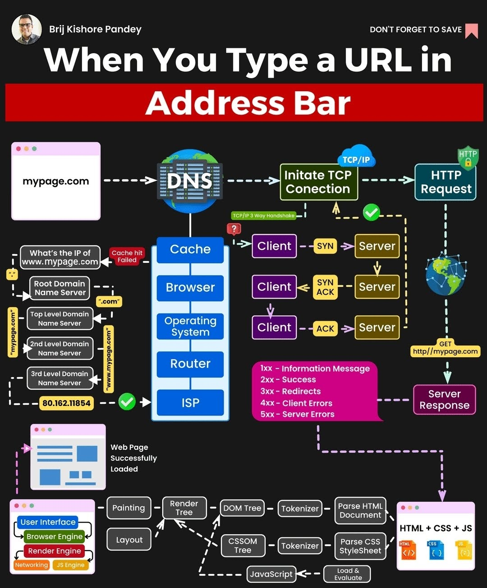
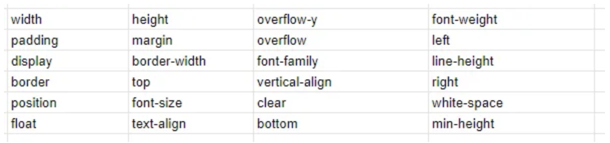

## Internet
- 

#### Browser Process
- Parsing
	- HTML
		- parse, convert to nodes, build DOM tree from nodes
	- CSS
		- parse, build CSSOM tree
- Rendering
	- after HTML and CSS finish parallel parsing they combined into Render Tree
		- render tree is similar to DOM, but without(`meta, script, link, display:none`) AND with(`:before, :after`)
	- Reflow/Layout
		- *layout - first iteration, other repetitions - reflow* 
		- build layout tree that is handling all elements/pseudo elements positioning
			- this process is handled by traversing Render Tree one/multiple times
		- changes of css will case Reflow
			- reflow can be done to part of tree OR all of it
			- it is better to reduce unused css and deep of tree for optimize
			- (partial list) 
			- `.getBoundingClientRect(), .clientLeft` and other JS operations can cause reflow
			- Reflow is done inside main thread(Event Loop) so it can be blocked
	- Paint/Repaint
		- *paint - first iteration, other repetitions - repaint* 
		- traverse layout tree and add color, bg etc
		- repaint triggerred by reflow, css, js
		- if it is animation all repaint+compose calculations are done via GPU
	- Composite
		- break all components into layers, rasterize, combine layers
		- done in separate thread
			- broken in tiles with priority to visible elements
		- LAYERS
			- transform, opacity, will-change properties move elements to separate layers

#### OSI Model
abstract network model for developing and communicating through network
- application
	- client-server communication
- presentation
	- compression + encryption
- session
	- queue of data transfer
	- handling client-server connection
- transport
	- used to handle which app is getting request by port(1-65535)
		- some of ports are reserved
	- used to break data to packets, check if data received fully etc
	- based on TCP/UDP
- network
	- used to complex data addressation via ip address
		- ip address - logical address that linked to device by network admin
			- some are reserved or may need to be registered
			- 0-255.0-255.0-255.0-255 (32 bit)
		- routers can be admins, that handle inner requests and outer request
			- they have two ip addresses: inner and external
		- all nodes are filtering out requests if they know nothing about receiver
- data link
	- check if data transferred correctly
		- usually by checking control sum
		- data transferred by small frames with linked meta-data
	- handle paralel data transfer
	- handle data path by mac address(xx:xx:xx:xx:xx:xx base16)
		- mac is linked to device on manufacture stage
	- switch, bridge
- physical
	- transfer data between machines
	- hub, repeater, modem

this model can be compressed to TCP/IP stack(layer - protocol):
- application - http, ftp, dns etc
- transport - tcp, udp
- network - ipv4, ipv6
- network interface - ethernet, wifi

#### TCP
Transmission Controll Protocol

- establish connection
	- 3 way handshake(want to connect - agree, want to connect - agree)
- transmit data with confirmation
	- STANDART TCP: send data(try again if no answer) - check if data transferred correctly, send that data received with next part of data that need to be received
	- Cumulative TCP: send bunch of data at once
- close connection
	- close - closed + close - closed

#### UDP
User Datagram Protocol(DNS is based on it)

send request(repeat if no answer) - receive answer

faster, but can loose some data(good for video/audio stream)

#### HTTP(S)
Hypertext Transfer Protocol (Secure)
used to transfer HTML, JSON, other data

message
- types: request - response
- STRUCTURE
	- method - version
	- path - status code
	- version(1.1, 2, 3) - text status

header(meta data)
- key-value
- host - required header

body(optional)

###### HTTPS
data is encrypted via TLS(SSL before) protocol

this protocol is done by system of public keys, certificate etc

###### REST
general rules how to implement API interface

methods
- GET users/ - User list
- GET users/:id - User details
- GET users?name=alex - filtered User list
- HEAD users/:id - similar to GET, but don't responds with body
- OPTIONS users/ - returns all headers that can be configured
- POST users/ + body - create new User
- PUT users/:id + body - fully update User
- PATCH users/:id + body - partially update User
- DELETE users/:id - delete user

status codes
- 1xx - info
	- 101 - switching protocol
- 2xx - success
	- 200 - OK
	- 201 - created
- 3xx - redirect
	- 301 - permanent move
	- 304 - not modyfied
- 4xx - client error
	- 403 - forbiden(auth)
	- 404 - not found
- 5xx - server error
	- 500 - internal server error
	- 503 - server unavailable

#### API
API(application program interface) - interface to interact with program

## Work with designer
#### Main points
- auto-layouts
- designer must use padding/gap instead of manual centering
- colors, fonts and sizes are based on predefined design system
- changes should be shown by comments

#### Animations
- lottie-web
	- designer makes animation for some object and send it as ready to use json
- framer-motion(react)
	- library of ready to use animations, that designers can choose from and devs easily implement

## Accessibility
Accessibility in web is big topic that includes(sorted by priority):
- keyboard controls
	- elements must be selectable by tab, forms submittable by enter etc
	- it is possible to make div natively selectable, but recommended to use only native tags(a, button, forms, inputs etc)
- screen readers(there are different types of them)
	- huge part of this topic is semantic elements, elements that have predefined meaning
		- historically `div` and `span` is used as main building blocks, but they have no meaning to screenreader and other devs, so there are number of `HTML5` elements, that work like containers(sometimes with special properties), but with this semantic meaning
		- `<article>` - independent peace of content, that can be understood by it's own
			- post, comment etc
		- `<aside>` - some content, placed aside main content
			- table of content
		- `<details>` - additional details, that can be hidden like accordion
			- `<summary>` - used to define always visible part of `<details>` 
		- `<figure>` - self contained content, like illustration, image(s), diagram, code
			- usually used with `<figcaption>`, that is semantic description of a `<figure>` 
				- placed as first or last element of a block
		- `<footer>` - bottom part of webpage, that includes contact info, navigation etc
		- `<header>` - top part of webpage, that includes headers, navigation, logo etc
		- `<main>` - main part of webpage
		- `<mark>` - highlighted text
		- `<nav>` - major block of navigation links, that contains hyperlinks inside
		- `<section>` - some content grouping, that usually has a heading
		- `<time>` - used to wrap a time text
			- can contain any data, but if it is correct time value, it will be localized by screen reader
- reduce monition, dark/light themes
- low quality screens
- colorblindness(contrast issues)
- gestures
- optimization for cases where no JS has loaded

accessibility must be firstly included in design

there some countries(EU, USA etc) with laws that obligates webpages to have certain level of accessibility

## SEO (Search Engine Optimization)
helps to fool search engine

main ways to improve:
- time that user spends on page
- how people got to page
- green lighthouse

`<meta>` tags are mostly needed for bots and not SEO

SPA is bad for SEO, so SSR is used(when we send HTML + JS that makes it work)

## SSR (Server Side Rendering)
we render HTML on server and send it along side with JS that makes it "alive"
based on [hydration](#hydration) methods

improves SEO, accessibility

good for open resources, but sucks for CRUDs

## Hydration
#### Island

## Frameworks
#### React native
converts react components to native IOS/Android elements
(realizes bridge pattern)

cons:
- still slower then native, because of JS layer
- for full native app simulation you may need to setup DB
- hard to manage navigation
- you often can have edge cases, so Swift/Kotlin may be needed anyway

use-cases:
- to develop MVP

#### Electron
not a framework, but a tool to convert existing web app to native desktop app

breaks into two parts:
- chrome instance with more rites that browser to render
- node.js server to work with OS
- both parts are communicate via post-messages

cons:
- hard to update(similar to other desktop apps), so you need a dedicated server to control versions + update btn somewhere
- slower and not as good as native

use-cases:
- fast and cheep web to desktop app conversion
- ATM "OS"

## LocalStorage
store data scoped by domain

- pros: native, easy to use
- cons: sync, slow, small storage size, sereallization dependent(stores all data in string)

alternative - IndexedDB(modern browser API that gives you way to work with DB via JS objects and built-in methods)

#### SessionStorage
same as LocalStorage, but scoped by tab+session

#### Cookes 
similar for LocalStorage, but used for client-server interactions
- often set by server and can be modified/seen by client

can be set to expire

## Virtual tables/lists
In order to render huge amount of data via list/table you can use virtual technic(by lib or custom one)

For lists you are doing local lazy loading(render data partially) + set some huge `hight`, relative to array length, so you can have native scroll

## GraphQL
Way of client-server communication for complex-aggregated requests. Basically introduces it's own language to create requests

Huge step in client-server communication evolution
- introduced Query-Mutation separation to front-end
- inspired react-query

pros:
- strictly typed
- easy to use on front-end
- great for BFFs
	- however, bff can be built to return prepared aggregated entities without GraphQL
cons:
- heavy requests are hard to restrict
- auth(mostly fixed)

## Web...
#### WebAssembly
Tool to connect any language with web

pros:
- heavy calculations can done on client
cons:
- not really useful

#### WebGL
Tool to pass heavy rendering to GPU

ThreeJS is based on it

Can be used for cool 3d websites, casinos/other games, retail stuff(3d models of furniture etc)

#### WebC:
Tool to pass calculations to GPU

Can be used for AI and stuff :)

## Internationalization(i18n)
i18n - short version of internationalization

i18n is deep theme, that includes
- translation
- data-time
- different variations of same language
- design
	- right to left
	- overall page layout(example: in Japan layouts are more cluttered then western)
- *and many more* 

#### Translation
good process:
- systematic
- easy, fast, async
- automatic
- l10n with context(screenshots etc)
- no monkey job

Translation management system(TMS) - system for translator to work with translation, that integrated in development
- manages translations similar to git(push source, pull translations)
	- can be integrated with CI/CD
- have translation memory(saves all previous translations, so you don't need re-translate prev knowledge)
- tools: Crowdin

one of the best localization frameworks: LinguiJS
- easy work with plurals
- eslint integration
- universal
- rich tooling
- lightweight
- compatible with international formats
- tags(like links) can be part of translation

## Shadow DOM
Shadow DOM is part of DOM, that is used for creating parts of component, that can't be affected by CSS or JS from regular DOM
- element can't be:
	- queried from JS
	- styled by CSS selector
	- etc

Basically we are having a shadow DOM root, that points to shadow tree, that will be joined with regular DOM on render

Shadow DOM is used to create incapsulated object, meaning we can manipulate Shadow DOM as regular DOM from inside of it, but can't interact from outside or with outside DOM

JS API
```js
const root = document.querySelector("#root");
const shadow = root.attachShadow({ mode: "open" });
const span = document.createElement("span");

span.textContent = "Shadow DOM";
shadow.appendChild(span);
```
- `mode: open` makes our component open to use from JS via `root.shadowRoot` 
	- it is not strict(extension can break it) and more like recommendation


HTML API
```html
<div id="root">
  <template shadowrootmode="open">
    <span>Shadow DOM</span>
  </template>
</div>
```
- everything in template is not visible by default, so we are using `shadowrootmode` 
- on render, `template` will be replaced with it's children, creating correct DOM structure

To style we can  use JS like this:
```js
const sheet = new CSSStyleSheet();
...
shadow.adoptedStyleSheets = [sheet];
```
Or add `<style>` inside `<template>` 
All in all, this styles will be scoped to this Shadow DOM

Often use-case is creating custom elements, with some inner workings, like this:
```js
class Circle extends HTMLElement {
  constructor() {
    super();
  }
  connectedCallback() {
    const shadow = this.attachShadow({ mode: "open" });
    
    const circle = document.createElementNS(
      "http://www.w3.org/2000/svg",
      "circle",
    );
    circle.setAttribute("cx", "50");
    circle.setAttribute("cy", "50");
    circle.setAttribute("r", "50");
    circle.setAttribute("fill", this.getAttribute("color"));

	const svg = document.createElementNS("http://www.w3.org/2000/svg", "svg");
    svg.appendChild(circle);

    shadow.appendChild(svg);
  }
}

customElements.define("filled-circle", Circle);
```
```html
<filled-circle color="red"></filled-circle>
```
*yep, I was pretty shocked too* 
