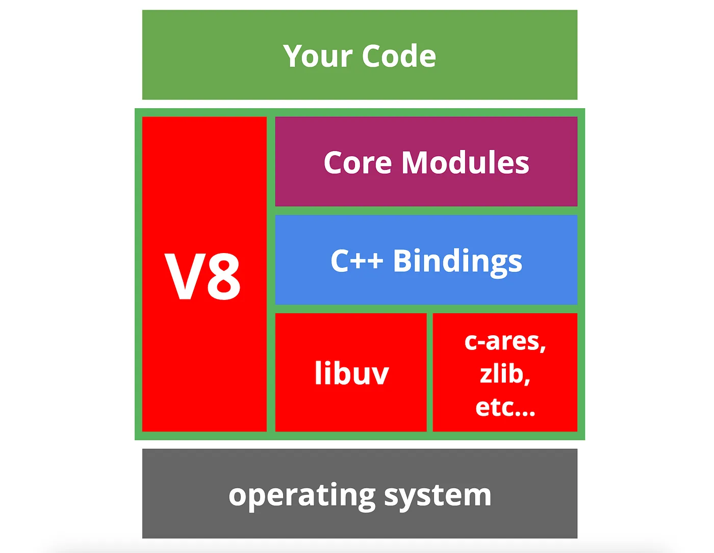
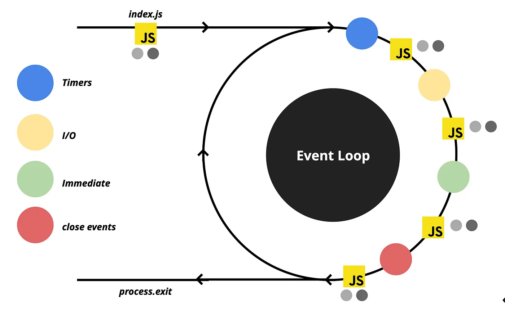

## Other
By using flag `--require ./path/toFile.js` for `node` we can add some file to be called with main file we call
- usage: add some global module that is not required in other files

#### Node shortcuts
npm run start -> npm start -> npm s?
npm install -> npm i
npm run test -> npm test -> npm t

#### JSDoc
add typing to functions with native JS

to use, add comment before function in this format:
```js
/**
* @param {number} a
* @param {string} b
*/
```

#### Interesting
- if you declare variable inside `<script>` tag it will become global

#### Stop Throwing Errors
JS doesn't treat errors as values, so we can't be sure that function won't throw at runtime without knowing it's implementation
- this leads to risk of missing try/catch

we can fix it by using explicit return type like this:
```ts
type Return = {success: false; error: Error} | {success: true; data: SomeDataType}
```
now we can be sure that function might return error, as well as handle it without try/catch

it is not always best solution, because sometimes it is good to throw error, so some middleware or other catcher will catch and handle it, but this strategy is useful

## Data normalizing
Data normalizing - process of transforming arbitrary list of data to list where we have one entity at a time and in other places we have links to this entity

## V8
JS engine by google

Compiles js into machine code with features like caching, optimizing, garbage collection etc
Used in browsers and Node.js

Code inside `try {}` is not optimized and usually slower

## Regex (Regular Expression)
Regex is used to validate/filter some text data
Works by comparing substr inside str

Regex is heavy operation, so better use simple expressions for small data sets
- sometimes better use self written solution

## Blob
Blob - binary large object, used in JS as basic protocol for working with binary data
- can be streamed
- there is blob->link conversion API, which is useful in cases, where you need to represent in-memory file via HTML element with src(or download via `a.href`)
	- to force download from JS we can create invisible `a` component and `.click()` 

## Service Worker
Service worker - browser api
- for simplicity we can call it as hybrid of proxy and js(file) between client and browser

- have ability to cache, work with requests etc
- async
- can't work with DOM directly
- is some file, that is scoped by page, globaly etc
	- if we have global and scoped sw on page only scoped will work

#### Use Cases
- usually used with listening fetch event
- caching (work with `caches` obj)
	- can make website work offline
	- usually better to init cache on install

#### Life Cycle
- Register. Triggers every time.
	- cases other steps
- Download. Can be seen in network, on registration
	- if registered won't be reregistered later
- Install. Goes directly after download and linked to it
	- can be listened as event
- Activation. Indicates that service worker is ready to work
	- can be listened as event
	- not always instantly triggered after install, so we can `self.skipWaiting()` on install stage
- Update. Triggered after changes inside js file, after ~24hours of AFK
	- causes downloading, installing and activation again

#### Other
- if we change request we will see old request and changed response
- active not working for first time, can be fixed with `event.waintUntil(clients.claim())` on activate
- can't communicate directly, only with messages
- external lib: work box

## Lodash
utility library to work with different data structures in compact and clean way

it is good practice to check if some method is present before writing it

popular methods are(by convention lodash is imported as `_`):
- `.sumBy(arr, () => number)` // calculate sum from array
- `.get(obj, 'location.to[1].propertie', default)` // find some data from nested obj by path
- `.groupBy(arr, () => propertie)` // group list of data by some field
- `.deepClone(obj)` // return a deep cope of some obj
- `.uniqBy(arr, 'field')` // filters array of objects to be unique by some properte
	- `.sortBy`, `.orderBy` // same, action is described in name
- `.isEmpty(arr)` // checks if array is empty or even present
	- native clean way: `arr?.length > 0`
- `.isEqual(obj1, obj2)` // check for deep equality


## Requests
#### Ajax
Tool to reload-less client-server communication

#### XMLHTTP
Old, native, everywhere supported method to request some data

pros:
- you can track downloading progress, so it is great for file upload related stuff

#### Fetch
Modern, well supported, native way of doing HTTP requests

#### Axios
Similar to Fetch, but it is a lib with some additional features, like middlewares

## EventLoop - Node.js
#### Node.js
Node.js - JS runtime build on top of V8 Chrome Engine, with event-driven, non blocking I/O model

I/O - input / output and refers to communication with PC's CPU
- libuv lib is handling multiplatform async work with I/O for Node.js
- 

Event-Driven model is based on Reactor pattern
- make I/O request(fs.read) -> passed to EventLoop -> passed to Event Demultiplexer -> calls C++ function -> result goes back to Event Demultiplexer -> result is wrapped into event and added to Event Queue -> when call stack is empty our callback is executed with data from event

Node.js components
- V8 - engine for parsing and execution of JS
- libuv - provider of EventLoop and I/O operations
- core modules - non standard JS modules like http, fs etc
- c++ bindings - wrapper to require custom compiled C++ modules
	- can be generated with Node.js compiler and required like this: `require('./my-cpp-module.node');` 
- deps - other small utility libs for low level operations

#### EventQueue - MarkroTasks
EventLoop - mechanism to semi-infinitelly process and handle events

Events are queued into several queues with different priorities and executed after stack is empty

| Queue Name   | Description                                                                | Priority | Is all events need to be executed |
| ------------ | -------------------------------------------------------------------------- | -------- | --------------------------------- |
| Timer        | queue for setTimeout, setInterval                                          | 1        | +                                 |
| I/O          | most of async operations(network, system)                                  | 2        | +                                 |
| Immediate    | queue for setImmediate(registered and executed as soon as JS picked it up) | 3        | +                                 |
| Close events | queue for closing connection events(DB, TCP etc)                           | 4        | +                                 |
Empty loop ~= few milliseconds

EventLoop is tracking how many ongoing tasks and when they are done, their count is decreased
- if equal to 0 loop is exited

`setTimeout(..., 0)` !== `setImmediate`, because EvebtLoop CAN(not always) be so fast, that timeOut won't be registered at all for this cycle and will appear at next

#### EventQueue - MicroTasks
I/O Polling
- I/O events are added to their queue not when they are ready(as other events), but after I/O polling

Between each macrotasks we have JS execution period of time(same as before EventLoop), inside which we have micro tasks as process.nextTick(1 priority) Promise(2 priority), with their own dedicated queues
- there also others microtasks as MutationObserver, queueMicrotask etc
- microtasks are checked by V8, after all JS is executed

process.nextTick have the highest priority among all of others, BUT can block EventLoop and kill performance

microtask queues block EventLoop and must be cleared

in Node version < 11 microtasks was executed between queues and not macrotasks, but for web compatibility it was changed

#### EventLoop
EventLoop is not fully part of V8, V8 is only parsing and executing JS + microtasks, but macrotasks are done by libuv
- 

#### EsModules
EsModules are async by design, so when we init our program, inside first EventLoop promises will have highest priority

#### libuv
I/O operations can be:
- blocking: file, dns etc
	- require different thread
- non-blocking: network
	- several tasks can execute in simultaneously

for blocking tasks libuv uses Thread Pool, so we can simultaneously execute this tasks on different threads(4 by default if any blocking operation is present in code)
on top of that we have threads that occupied by default for garbage collection etc

DNS lookup is blocking, but can by made it non-blocking with some effort

#### Other
Custom promises(Bluebird.js)
- Can collet all promises into one macrotask to reduce blocking time
- Can executer promises on some other phase

## EventLoop - Browser
Similar to Node.js EventLoop, BUT with addition to some DOM related tasks and with no strict order in macro/micro tasks queues

Most of the time JS engine doing nothing and runs only when some event, script, handler activates

Rendering happens between macrotasks and blocked by their execution
- some very heavy tasks can block whole browser(not responsive to user events), so browser might suggest to kill this process with page

Same as in Node microtasks queue empties in-between each macrotask
- microtasks are mostly come from promises, but can be also manually queued by `queueMicrotask(func)` 

macrotasks
- setTimeout
- setInterval
- setImmediate
- requestAnimationFrame
- I/O
- UI rendering
microtasks
- process.nextTick
- Promises
- queueMicrotask
- MutationObserver

Other
- heavy tasks can be split into smaller once and wrapped into zero second setTimeout, that will not block DOM
	- it is better to setTimeout earlier in code, because even zero second timeout has some delay in it
	- you can show some loading via this split, because otherwise change in DOM will be shown after whole process is finished

## Regex In JS
To create a regex in JS we can use `new Regxp("pattern", "flags")` or with `/pattern/flags`. This will resolve in Regex object

Methods on Regex object:
- `.test(string) -> boolean` check if string has a match
- `.exec(string) -> array | null` executes regex and returns array of matching groups
	- `array` will include:
		- "0" - matched string
		- "groups"
		- "index" - matched string index
		- "input" - original string
	- it acts as an iterator and, when there is no left matches it return `null` 

 regex flags(5 in-total, most important bellow):
- `g` - search for all matches
- `i` - case insensitive search

## General Patterns
Patters provide common solution for different problems and serve as general guidelines
There are list of JS specific or classical(with modifications) patterns

- Command - don't execute methods directly, but create command interface with `execute` method and extend from it, by calling specific method with specific command
	- pros: decouple method usage from it's user, command can be queued and reverted
	- cons: boilerplate, complication of code
- Factory - create a method that will create class instances
	- in JS we can also just create objects from giving parameters
	- pros: creation of complex object(with backing env state into them), additional logic(caching, additional calculations), creation of objects with similar interface(but avoiding classes)
	- cons: `class` is mostly sufficient for this task(but class is still can be used with factory for adding additional logic over default constructor)
- Flyweight - split class's data that is static(newer changes) and dynamic(can be changed often) and break into to classes, store "static" class in some cache, to prevent unneeded object creation(aka RAM usage) and reference it in "dynamic" class
	- in JS we can also bind static and dynamic data via prototype inheritance
	- pros: less RAM usage with large number of objects created
	- cons: more complex code(in general you should only use it as optimization matter)
- Mediator - remove direct object communication and make them communicate(can be uni and bi directional) with mediator, that delegates all the work between objects and only processes request/result
	- similar pattern is Middleware, that takes request, do smth with it and pass along the chain, where it can be taken by other Middleware or by receiver
	- pros: less coupling between objects(makes many-to-many communication easier)
- Mixin - change inheritance with delegation, by passing mixin object with needed functionality to class and delegate tasks to it
	- NOTE: passing functionality into class is more TS way, so to safely do so you need to specify type of this. Other approach is to modify prototype(not safe operation)
	- mixin, by itself, can use inheritance
	- only used to add functionality to other object
	- example: `window` object, that includes large number of different mixins
- Module - logically split code into independent, reusable chunks. With keeping parts of module private
	- JS has many variations of modules, with newest and mostly recommended to use ESModules(import/export syntax)
	- private fields prevent naming collisions
		- other naming collisions can be prevented via `as` renaming, when importing some part of module
	- ESM won't pollute global scope(usually `window` object) with exported parts of module
	- we can export some part of module as `default` export, which may be useful to indicate main functionality of module(for example react Component is default export, while it's components, as not main part of module, are just exported)
	- module can be imported like
		- `import someDefault from ""` 
		- `import {someExp1, someExp2} from ""` 
		- `import * as fullModule from ""`, where:
			- `fullModule.default` -> `someDefault`  
			- `fullModule.someExp1` 
			- note that this way is disregarded, because we might import unnecessary parts of module
			- we still can't import private parts of module this way
	- when working with UI framework, it is a good practice to keep 1 module for 1 component
	- when conditional or deferred import is needed we can use async `import("") -> Promise<module>` to do so
		- often used as optimization matter
		- unlike default imports, we can use template literals here
	- transpiling is needed, to use modules in pre ES2015 envs
		- basically the will merge modules into one file, with adding scopes via function wrapper
- observer - observer object is subscribed to observable object and notified each time, when some event in observable occurs
	- great for working with events and async operations
	- example: RxJS
	- pros: separation of concerns(observable monitors events, observer handle function execution)
	- cons: performance with too many subscribers
- prototype - share properties between objects(a way to do inheritance)
	- native to JS(in pre classes we were basically managing prototypes by hand, now we have sugar syntax with classes)
		- basically, when accessing an object method, JS will check object, if it has one, that it's prototype and on and on and on
			- as an example, `Object.create(proto)` will create object, with assigning passed prototype to it
		- it is possible, but disregarded, modify prototype on fly
	- pros: optimization(we only reference one object with needed methods)
- provider - if data is needed in many places or somewhere deep in code, it is better to create provider, that will give access to the data, instead of passing it down via the props
	- example: React Context
		- in React, it is common to implement:
			- helper hooks, that call `useContext(Ctx)` and return value, with addition `null` check, that throws, if it used outside context
			- HOC, that incapsulates logic of context and provides context value
			- ---
			- by doing both, we separate logic of getting and providing values from components
	- use-cases: global data(current theme of an app)
	- pros: avoid prop drilling(easier to refactor+read code, easier to find origin of value), global state
	- cons: performance(consumers need to react to each change of context)
		- to deal with performance, just don't overuse context and break it into smaller one
- proxy - add additional behavior to object, by wrapping it fully/partially in proxy
	- basically, proxy adds layer of logic in front of method
	- we can implement proxy or use built in JS `Proxy` object, that takes original object and config, that will change interactions with passed object
		- common config methods:
			- `get(obj, property)` 
			- `set(obj, property, value)` 
	- other API to work with proxies is `Reflect`, basically it is used as sugar to do standard operations easier, like:
		- `obj[property]` -> `Reflect.get(obj, property)` 
		- `obj[property] = value` -> `Reflect.set(obj, property, value)` 
	- use-cases: validation, permissions, formatting, logging, debug
	- be careful with performance
- singleton - allow only one instance of a class to be created
	- implementation:
		- generally just store nullable reference to created instance(as static filed), and return it, when user requests via separate method
			- worst noticing, that it might be a good idea to freeze object, thus preventing accidental changes to it from outside
			- also we can avoid class implementation at all and just create single object + freeze it
		- in plain JS we need to `throw` in constructor, if instance is no null
		- in TS we can make constructor private and create a factory to avoid throwing errors
	- use-cases: global shard state, optimization
	- drawbacks: global state management problems(hard to test, unexpected behavior in parts that rely on this global state, data flow is unreadable)
		- it is generally considered an anti-pattern(JS also accepts this statement)
		- of corse we need global state in app, but it is better to use some pre-build solutions, that makes state read-only or implement proper mutation system
- static imports - default ESM `import` is example of static imports pattern, which job is to give current module access to parts of other modules + include this parts in final bundle
	- static imports load data in locking sync manner
- islands rendering - allow to pre-render static parts of an app on server, with keeping dynamic parts as is(they can hydrate directly on client or via server-side rendering too)
	- drastically improves performance(less JS shipped and ran on client) and CEO(all content is pre-generated) for an app, with keeping it interactive
		- prioritization to content first and interactivity second
		- better accessibility
	- ABOUT REHYDRATION
		- it is a process of binding into pre-rendered HTML with shipped near it JS on client
			- differs from default hydration, by including pre-rendering step
		- can be done in different ways:
			- SSR - fully render on server
			- Progressive - render part of an app, other parts are rendered and shipped as needed
			- islands - break app into static and dynamic parts, ships static as is an dynamic with needed JS + do hydration
				- hydration can be done in different moments of time:
					- on client only
					- on server + rehydrate on client
				- island is self contained
				- unlike SSR/Progressive rehydration, one component won't block other, because their process of hydration is async
	- how to do islands:
		- render static content with no JS on server
		- dynamic content must be filled with placeholders inside static content + rehydrated as soon as main thread is idle(requestIdleCallback)
			- `requestIdleCallback` is used to implement scheduling
		- allow isomorphic rendering, thus using same code to render on server and on client
	- examples:
		- Marko - automatically decide wether component is dynamic
		- Astro - static site generator, that creates lightweight apps, that can use dynamic components from other frameworks. Allows lazy loading
			- was built to work with islands with component based design
		- Preact(static site generator) + Eleventy(isomorphic compatible components) - combination to do islands, with lazy loading
	- use-cases: blogs, news, landings, e-commerce etc
	- DRAWBACKS:
		- not useful for highly interactive pages
		- new topic(not many guides, patterns and practices are not existent yet)
- rendering - there are many modern techniques, when it comes to "where" and "when" to render
	- NOTE: this section is not about general patterns, but kinda a vercel add ;)
	- main way to choose is by finding best solution to your case, with consideration of UX and DX
		- it will lead to: fast development, fast load times, low cost of processing
		- remember that each pattern is designed to solve one issue with introducing other tradeoffs
			- in general SSR or progressive hydration is a way to go, but they might be harder to cook, overkill or just not sufficient for some cases
		- it might be a good solution to choose different patterns to different parts of an app
	- MAIN CONCEPTS
		- CWV(core web vitals) - set of optimization metrics to improve UX
			- time to first bite
			- time to interactive
			- first contentful paint
			- cumulative layout shift - visual stability of an app, to avoid interface shifts, when content is loaded
			- largest contetful paint
			- first input delay - time between user interacts and event is handled
		- DX points to improve, so product is developed fast and smooth
			- fast build times - build + deploy time
			- easy rollbacks
			- low server cost
			- reliability of an app
			- performance of dynamic content
			- scalability(in both ways)
	- PATTERNS:
		- static rendering - render content on build and keep it as is
			- used together with CDN(caching, faster request processing)
			- TYPES:
				- plain - render content on build and keep as is, with possibility to add dynamic components with rehydration
					- pros: fast load times, CEO friendly, low cost
					- cons: only for static content and pages that don't rely on data
				- with client-side fetch - render content on build with placeholders, that will be changed to dynamic components with rehydration, that will `fetch` and paint data
					- pros: fast enough load times, CEO friendly, allow dynamic content
					- cons: harder to scale, more server to keep running, content shift
				- with server-side backing of the data(getStaticProps) - similar to plain, but with piping dynamic data to HTML, when building it
					- similar to plain, but with slower build times
					- also, we might need separate service for better separation of concerns
						- it might be costly to do API calls on each build
				- incremental static rendering - generate some pages at a build time, while other are generated, when user requests them
					- we can easily cache the new generated pages
						- for dynamic pages we need to set invalidate period, so next request will invalidate and trigger regeneration
					- pros: fast enough load times, CEO friendly
					- cons: high server cost(for very dynamic content invalidation is near instant, so non-needed invalidations might happen), might be harder to maintain, can't be user specific, cached only on edge
				- on-demand incremental static rendering - similar to incremental static rendering, but regenerations happens after event occurs and not invalidation happens
					- pros: fast, cached CDN wide, CEO friendly
					- cons: can't be user specific, might be expensive
			- all in all, good solution for semi-dynamic pages with non-user specific data
		- server side rendering - HTML is rendered on each request, that allows for highly dynamic pages, with user specific data and possibility auth
			- in it's core, each request produces custom HTML + with JS bundle send right after to do rehydration
			- it is fast and easy to build, but pretty slow and costly
				- also might need separate API service for separation of concerns(note that API call will block rendering, so it is better to keep it close or on same server)
			- it can be optimized wit
				- granular rendering of dynamic and non-dynamic parts(breaking app into islands)
				- react server components to avoid shipping large dependencies to client
- bundle splitting - modern JS code is often bundled together in large file, that can be slow to download and pars, which is blocking operation to render page
	- it is useful to split parts of an app into separate bundles, making them load async in background, thus not blocking main thread
		- it is a tradeoff operation, because we enable faster first load, but now need to wait for parts of an app to download, before user can interact with them
		- it can be nicely done via `React.Suspense` or similar solutions to manage async state
			- it may be problematic to use with SSR, so some lib(like `loadable`) can help here
		- note that additional bundler config may be required
	- it is not possible to do auto bundle splitting, so it is mainly used with large libs
- animating view transitions - modern browser API to add transitions, between DOM changes(from small toggles to page changes), that is very useful for SPA apps
	- from JS perspective we call `document.startViewTransition(cb)`, where callback will do changes
		- basically browser makes snapshot of DOM state before and after `cb` call, and then do smooth transition in between
	- by default we will get linear crossfade with some default time, but it can be changed via CSS, like so: `::view-transition-old(root),::view-transition-new(root) {animation-duration: 2s;animation:...}` 
		- to do more granular actions, we can add groups via names like so:`view-transition-name: photo-heading;`, to reference elements + specify containment: `contain: layout;`, which allows us to do partial animations, only on this groups
		- to do navigation animations, we can call `startViewTransition` on navigation, BUT return a promise, that will wait until re-render happened
			- this won't block interface, when re-render or page fetching happens, but when promise resolves, transition is smoothly performed
			- for snappier animations we can do alternative approach, by animating out first HTML, wait until new page loaded + animation completed, animate in second HTML, BUT this way we are loosing transitions between elements
			- all in all, there are plans to do native animations between pages OR you can use some lib :)
- compressing JS - there are quite a few techniques to compress and split your bundle, so here are some strategies to do so with pros&cons(some can work against each other)
	- JS is largest, after images, by contribution to page size, so it is important to keep an eye on it's size
	- general info
		- mathematically, compressing one big file will make final size smaller, that breaking and compressing it parts
		- when bundling and serving files use gzip or brotli(better both, so users with newer browser will get better, brotli compressed, data, when still leaving gzip option for older browsers)
			- browser will always tell what it supports via `Accept-Encoding` header, while server uses `Content-Encoding` to indicate one
				- using this headers you can also see, are really files compressed
					- this will be also told by LightHouse report
	- HTTP compression - compress data to take lower space
		- lossy - some data is lost(reasonably), with higher compression, which is great for media files
		- lossless - data is compressed into less size, but can be precisely restored back
		- done with gzip, brotly etc on build OR serve step
			- doing on build will result in slower build times, but lower server resources usage and higher compression
			- you can even do both, but it might be not really useful
	- minification - reduce file size, by removing unnecessary data(whitespaces, long variable names etc), while keeping code valid
		- common for JS and CSS, but can be used with other files, like HTML etc
		- as a good practice, library author should provide minified `.min.js` file
		- done on build step with some tools(pick most popular one ;) )
	- bundling and splitting code - we can pack together or split or JS code to load all at once, or by some chunks
		- about:
			- module - encapsulated part of program
			- bundle - modules packed together, after compilations
			- bundle splitting - breaking bundles into separate parts, for better caching, isolate publishing, deferred downloads
			- chunk - part of splitted bundle
				- it is important to have always request parts be in base chunk and other are packed together with ranking of needability
				- all related code should be bundled together
		- pros/cons:
			- larger chunks will take less total space
			- smaller chunks will be better cached
			- if action results in another chunk loading, actions will take longer time than it should
		- all in all, recommended size is around 10 chunks, but you can break some heavy dependencies or parts of an app into separate chunks
			- it is considered best practice to move 3d-party dependencies into separate chunks
- import on visibility - pattern to defer load of some data, to point when it becomes visible
	- it can be done to static files like images, API calls(infinite scroll) or even parts of bundle via some libs(`react-lazyload`,`react-loadable-visibility`) or hand rolled
		- all of it is based on `IntersectionObserver API` 
	- don't forget about tradeoff, that now user needs to wait until something is loaded
- prefetch - pattern to fetch some data in background, that might be used in future(result in near instant interactions with "non-loaded" data)
	- ways to achieve:
		- HTML: `<link rel="prefetch">` 
		- HTTP: `Link: </js/chat-widget.js>; rel=prefetch` 
		- Service Workers
		- some custom solution with bundlers
	- don't over prefetch, it may cause slowdowns, only do when user will most likely need that data
		- a good rule of thumb is to disable prefetch(if possible) for low tier devices
- import on interaction - some heavy parts of an app(often 3-d party) can be loaded async, when user interacts with component, that depends on it
	- if we initially load resource, it will block the thread, so we can make it load in deferred way, BUT it will slow down interaction with this component, so don't overuse this technique
	- ways to do:
		- Eager - default way to load right away
		- lazy on route navigation
		- lazy on click
			- this is good alternative to SSR, which can lead to poor experience of page loaded, but not yet intractable, WICH won't happen to lazy click, because we can interact with page, it just takes a bit longer to download smth
				- note that more complex technique includes tracking user clicks and replaying them, when JS is loaded+inited
				- we can also start loading on hover, but it maybe more resource draining
			- by doing it async, data that needed by the components will also fetched in async
		- lazy on scroll into view
		- prefetch - load after main thread, when idle
		- preload - load as soon as possible
		- ---
		- for your code it is better to do prefetch
			- exception is cases, where user can click on something, before it is prefetched
		- with 3-d party code you can do it in any point of time
	- good technique to utilize is some facade component, that acts as placeholder with bare functionality of original code, that loaded in async manner
		- example:
			- video player can be facaded with image and play button and when user clicks, it goes into loading state and replaced by actual player
			- login button that loads SDK separately
			- chat button that waits until users needs to chat
	- how to implement:
		- dynamic async import in JS
			- alternative is to dynamically inject JS `<script>` into page
		- `Suspense` + `lazy` in React
		- to break bundle itself proper bundler config is needed
	- one more technique is to replace embedded code with some static(generated progressively or on build time based on some data) with link to more interactable version
- optimize your loading sequence - app performance and WebVitas passage is heavily influenced by how/when we load files
	- what can cause poor loading times:
		- requesting resources in wrong order(web vitals are estimated in specific order)
		- underutilizing CPU/Network
			- example: if loading files in parallel, CPU will start processing JS much later, then doing it sequentially
		- heavy 3-d party libs
		- resource optimization
			- inlining CSS, bundling&splitting JS, several image sizes(depending on platform, low-quality placeholders), removing dead code
				- JS can also have additional problems with: poor written modules that can't be tree-shaked, unneeded ES5&Polyfilling
	- what can be done:
		- inline critical CSS for better FCP OR at least serve it from same origin as HTML with preload
			- for 3d-party CSS you can create a proxy
			- don't over-inline, because it causes slower HTML parsing and disables caching
			- fonts should be requested as soon as possible, with `preconnect` 
				- most common solution is to provide font-fallback, but be careful with jumping layouts
		- for images use low-quality placeholders, with same visual size, but lower resolution(be careful with making it too low and not trigger LCP)
			- if image is not visible, use lazy loading
		- for JS:
			- be careful with sync 3P scripts
- tree shaking - process of removing any unused code from bundle
	- unused code means code that don't used anywhere else or parts of code with no side effects
	- usually done automatically be bundling system, but can be tricky in some cases
		- general process of doing is to parse code into AST and travers it to determine
	- EDGE CASES:
		- only ESM modules can be tree shaken
		- when module is imported it is executed and if such execution contains any side effects(global css or scope modifications etc) it won't be shaken
- preload - `<link rel="preload" />` allows to prioritize load of one resource over others, no mater where it is located in document
	- such resource might block any other load, so be careful of overusing it
		- still it can be a great way to load critical resources upfront + in parallel, if done like so: `<link rel="preload" href="emoji-picker.js" as="script" /> <script src="emoji-picker.js" async />` 
	- notes:
		- HTTP preload header has higher priority over script tag
		- font is best candidate for preloads
		- img preload has lowest priority
		- be careful with preloading script, that is a part of dependent(not preloaded) script
		- server need to server preloaded content with priority too
- optimize loading 3d-parties - there are set of best practices for loading external resources
	- where slow-down comes from:
		- calls to 3d-party server
		- larger resources(bulky JS, unoptimized images etc)
		- resource influences page in unpredictable way
		- blocking behavior included into resource
	- to find pain points use Lighthouse, WPT and Bundlephobia
	- ways to fix:
		- remove resource OR replace with lightweight alternative
		- optimize how/when resources are loaded:
			- async/defer for non-critical scripts
				- note that it will lower browser priority for resource
				- it may be good to even defer some scripts to the point, when page becomes interactive
			- establish early connections to required origins using resource hints for critical scripts, fonts, CSS, images
				- lower time for getting resource by dns-prefetch or preconnect(includes dns-prefetch)
			- lazy load non critical or out-of-view resource
				- use `loading` attribute with iframes
				- use some lib or custom Observer API implementation to defer loading
				- use facades(self written or 3d-party implementations) + load on interaction
					- be careful with sizings and layout shifts
			- self-host JS scripts and fonts to lower request trips(no need for TCP handshakes and DNS look-ups)
				- it is also possible that 3d-party have poor caching or compressing
				- great deal when using with HTTP/2
				- consider using CDN as storage
				- don't forget to update your resources from time to time
			- use caching via service workers if possible
				- enables better control over cache and offline mode
				- lowers need to self-host
			- don't use resources like Google Tags, reCaptcha etc, on pages, where they are not needed
				- you can even defer their load, on pages where they are truly used
				- with Google Tags you must not load it, when user denies Cookies
	- there is a great implementation of `<Script>` component in Next.js, that gives you out of the box optimizations or some libs like Partytown, that do it in agnostic way
- list virtualization / windowing - render only part of list/content and change this rendered part onScroll, rather then rendering full list at once
	- all in all just use some lib to handle it, because it is quite tricky
		- *and I just don't like the general UX with problems like `cmd+f` search, that related to it :/* 
	- in its core creates one tall DOM element, that roughly the height of `elementHeight*numberOfElements` and small DOM element, that have scroll overflow and changes what elements are renderd
		- this results in massive performance boost, when talking about ginormous 1k+ lists
		- it is also possible, but less common, do windows for 2D layouts
		- also great in combination with infinite scroll
			- user won't lag himself, by scrolling to long
	- there is more native approach with CSS's `content-visibility:auto`, that acts as optimization matter for out of view content, but it is still better to do virtualization for dynamic pages(it is just more efficient)

## Open Social
Open Source software is common standard nowadays, which might be great example for social networks AND data in general and became an inspiration for AT Protocol (atproto)

Common view of the web - each party has it's own data, enclosed inside their websites, while still can be shared and co-linked by other websites
- in such model you can host your data via any provider AND don't depend on them, because you have stable addresses
- BUT most often data is published into other party's website, thus you not only loose data ownership, but also vendor lock yourself to it
	- and Close Social with our current social media apps emerge
	- it has benefits:
		- data can be turned into different representations
		- data has single source, thus global search, ML, feeds, notifications etc is enabled
	- Close Social creates tight social space
	- > If you can’t leave without losing something important, the platform has no incentives to respect you as a user.
	- you can't even export data (technically you can, but it won't be meaningful without other parts of social graph and representation)

Open Social
- each user will have domain-like identifier, that bounds data to him
- data is stored in repo and server as signed JSON and could be freely moved from one vendor to other, while still preserving graph integrity
	- basically we have same web structure, BUT not in form of hyperlinks, but it form of linked JSONs
- other services can be integrated in this system, but letting them create records in your repo
	- so you can interact with any system, BUT you can also represent and use their data in different formats
	- services can easily interact with one another without need for API
	- this leads to possibility of forking OR creating analogs of products
- to query & aggregate data efficiently you can use websocket (with single user OR aggregated socked with data about many users) and clone data into your DB
- all traffic is cryptographically signed, so you can verify it's legitimacy

#### at://
The technical details on how atproto works and resolves it's URIs
- main part of at points to user, after which we specify format and some query
	- this means that we need to some steps to locate where data is physically hosted
- resolutions:
	- handle -> identity
		- handle might change, BUT identity can't and acts as stable point, so multiple handles can resolve to single identity
		- you get identity by handle via DNS or HTTPS, BUT given identity need to verify back that it truly associated with given handle
		- this means that you should store identity links, not human readable links
		- to verify handle relation you identity provides data with list of owned handles
			- it will also point to server address with data (identity -> host)
		- you can have identities in `web` format OR in `plc` format
			- `web` is standard, decentralized one, which creates risk of loosing access to your identity
			- `plc` is on of vendor locked format, that acts as registry, thus has less decentralization
	- host -> JSON data
		- just combine server address with data from URI and query normally
- you can just use SDK to do resolutions for you, BUT account that ideally you should hit local OR remote cache instead of DNS first


## You don't know JS book
>I've also had many people tell me that they quoted some topic/explanation from these books during a job interview, and the interviewer told the candidate they were wrong; indeed, people have reportedly lost out on job offers as a result.

#### Naming and Spec
JavaScript is named after Java as branding for "web Java" and name still owned by Oracle
JavaScript/JS has official name ECMAScript(ES) and it is also a standard for how to implement JS(browser, Node.js erc)

TC39 is tech committee that decides on new changes and later addresses them to ECMA
- TC39 is managing open source proposals too
- every proposal are gone gone through 0-4 stages

JS engines (ideally) fully implement JS spec
Spec has appendix B that includes some historical inconsistencies in browser JS spec
Some methods like `alert`, `console.x`, `fs.write` etc aren't in spec, but universal-ish in JS environment

JS is muliy-paradigm lang

#### Updates
JS is backward compatible(new changes don't break old code), but not forwardcompatiable(new changes can't be run in old version)
- HTML/CSS are opposite

To address forwardcompatiable problem transpiling(babel is most popular) invented
- transpiling - converting new syntax to old one, like `let` -> `var` 

Transpiling won't help in new-new-API case, so dev can write polyfill(wrapper for new API that implemented with old APIs)
- there are library of official polyfills
- often babel can add polyfills

#### Interpretation
There two polar types of langs: interpreted and compiled, BUT it is not binary and rather a spectrum
- interpretation works by executing code line by line
	- any errors are throw in run time
- compiling works by converting code to Abstract Syntax Tree (AST), analyzing for static(syntax, type etc) errors, then to binary code and then executed

JS has a parsing step and kinda compiled, but not fully
- kinda, because after parsing it has conversion to optimized binary code(binary intermediate representation), that can be executed by virtual machine aka JS engine(similar to Java)
JS also has Just-In-Time optimizations on BIR(post parsing)

#### WebAssembly(WASM)
In it's core WASM is tool to convert some lang to binary representation of JS, that can be read by JS VM without need in additional optimizations

It is also suitable like general purpose VM
- ironically it is hard to WASM to convert JS itself because of lack of type-safety :)

#### Strict
Optional(highly enforced in new code bases) list of additional rules to make JS safer and cleaner
- best-practice is Strict + linter + prettier
- de facto is default but technically not for backwardcompatability

some of strictness comes in form of new Static errors
in strict `this` defaults to `undefined` 

turned on with `"use strict";` on first line per file
- can be not on first line if there are comments/blank space above

ES6 modules enforces strict

#### Files
Each file is a program, but executions helps them to organically communicate, by mixing them in a runtime
- it is done, so if one file throws, other will still operate
Seamless communication is achieved via global scope, BUT after ES6, we can make files to be scoped(modular)

#### Values
- primitive
	- string - ordered collection of chars, can be defined with quotes(\` ' ")
		- \` - doing interpolation on string, aka resolving some value into string
	- boolean
	- number
	- bigint
	- null
	- undefined
	- symbol - unguessable, uniq value, that can be used as object key
		- created by Symbol("string"), BUT Symbol("string") !== Symbol("string")
- objects
	- array - special type of object for ordered, numerically indexed collection of items
	- object - unordered, keyed collection of items with string keys

typeof tells type, BUT with some catch :)

```js
typeof 42;                  // "number"
typeof "abc";               // "string"
typeof true;                // "boolean"
typeof undefined;           // "undefined"
typeof null;                // "object" -- oops, bug!
typeof { "a": 1 };          // "object"
typeof [1,2,3];             // "object"
typeof function hello(){};  // "function"
```

coercion is converting between types

value can be literal(declared in place) or stored in some var

#### Var, let, const
*junior interview be like*

|              | var | let | const | function |
| ------------ | --- | --- | ----- | -------- |
| mutability   | +   | +   | -*    | -        |
| block scoped | -   | +   | +     | -        |
| hoisting     | +   | -   | -     | +        |
\* - if const is a pointer, it's referenced value still can be changed, BUT it can be const via TS `as const` 

#### Functions
We can call JS functions as procedure - collection of statements that can be invoked one or more times, that has output/input

- `function name(){}` - function declaration, with name to func mapping on compile state
- `const name = function(){}` - function expression(function is assigned to to var as expression), where function is associated with it's name on runtime

JS functions are treated as values(or special type of Object) and can be passed around as in Functional Language
- function in JS is first-class value

Func can receive 0-infinity parameter(local to function vars)

Func can be set as Object param

#### Comparisons
- strict equality `===` - compare two values, without possibility of converting types
	- type equality is always checked, but in === it is strictly must be the same
	- NOTE
		- 3 === 3.0 // true
		- NaN === NaN // false
			- Number.isNan(NaN) // true
			- Object.is(NaN, NaN) // true
		- 0 === -0 // true
			- Object.is(0, -0) // false
		- {} === {} || \[] === \[] etc // false
			- because it is pointers comparison(opposite to structural equality, where we compare content)
	- coercive comparisons OR loose equality `==` - compare two values, with converting to same type if possible
		- agreed to be dangerous to use
		- `==` and `===` do same value comparison
		- tend to do primitive numeric comparison
		- can't be avoided, because `> < >= <=` are also coercive :)
			- two strings will resolve in dictionary-like comparison 

#### Code Organization
- classes
	- class defines a "type" of custom data structure that includes data and behavior
	- class is not a value, but value can be got from class via `new` aka class is instantiated
		- methods can be called only on instances
	- inheritance is JS is done via `extends` + `super()`, so we can define common parent and extend it's functional
	- JS classes also have polymorphism, because they allow children classes to override existing methods
- modules
	- have same goal as classes to combine data with behavior, with additional possibility of module interactions
	- Classic Modules
		- it is similar to classes, but we are creating a function, that incapsulates data and returns some object with methods to interact with data inside
			- factory pattern
	- ES Modules
		- wrapping function is changed to wrapping file that incapsulates all data and `exports` all behaviors
		- we can say ESM is a singleton, caze it's instance created on first `import` and after that other imports receive a reference

#### Iteration
It is important to have consistent method to work with large quantity of data, that's why we have iterator pattern, that can iterate through some set of data and stop iterating at some point

there is `next()` method in JS, that returns object named iterator result, which consists of `done: bool` and `value: any`, where done indicates, that iteration of set is finished

`for of` is a syntax to consume iterators
`...` - spread and rest operator
- SPREAD
	- this form of operator is an iterator consumer
	- we need some place to spread data into(array, function call)

iterator was created as base for iterable values aka value that can be iterated
- iterator instance created from iterable on demand
- string, array, map, set etc - iterable, so we can do smth like this:
```js
const greeting = "Hello";
const chars = [ ...greeting ];

chars; // [ "H", "e", "l", "l", "o" ]
```
- map has iterator that returns tuple value in a form of `[key, value]` 
	- `.keys()` gives us a list of keys
	- `.values()` gives us a list of values
	- `.entries()` gives us tuple, but for any iterable(for array it will be: `[index, value]`)

#### Closures
>Closure is when a function remembers and continues to access variables from outside its scope, even when the function is executed in a different scope.

objects don't have closures, only functions

common closure use-case - async functions, when we close some data inside function, that is executed after some time, but still remembers data

#### This
Function has two characteristics:
- scope - attached to function via closure, represents a list of static rules, that controls resolution of references and values. It is attached, when function is defined
	- hidden inside JS engine
- context - similar to scope, but attached on call stage and can be accessed via `this`. Context is dynamic and can differ from call to call
	- object, that has properties, that made available for function
	- this aware function - function, that depends on it's context

if this aware func is called without strict mode, it will look to it's context and then to global window object, in order to resolve value

WAYS TO MAKE THIS AWARE FUNCTION:
- call function as object method -> this === object
- function.call(obj, arg1, arg2) -> this === obj
- function.apply(obj, \[arg1, arg2]) -> this === obj
- const f = function.bind(obj) -> this(inside f) === obj

classes are heavily based on `this` 

#### Prototype
NOTE: JS is one of not many, who give access to direct object creating

`this` is characteristics of a function and prototype is characteristics of an object that helps to resolve property access
- basically prototype is hidden link between two objects
- prototype chain - series of objects linked via prototype
	- it is called "behavior delegation"
- prototype helps in delegation(inheritance) of methods
	- by calling some method on current obj, JS will try to find it on this object first, than on it's prototype in chain and return first occurrence || undefined

`const newObj = Object.create(obj)` - safe way to set newObj.prototype to obj
- if obj is null, newObj will have no prototype(event Object.prototype)

`this` highly benefits from prototypes. It is dynamic in JS and can resolve from different objects. Example:
```js
var homework = {
    study() {
        console.log(`Please study ${ this.topic }`);
    }
};

var jsHomework = Object.create(homework);
jsHomework.topic = "JS";
jsHomework.study(); // Please study JS

var mathHomework = Object.create(homework);
mathHomework.topic = "Math";
mathHomework.study(); // Please study Math
```
as we can see `this.study` resolves from homework, but `this.topic` still from object itself

#### Scope
Scope is well defined list of behavioural rules about variable and how engine interacts with them

Lexical scope model
- scope is a block of code in which variable can be accessed
	- can be nested
	- variables from higher scope can be accessed, but not from lower
	- how variables are placed determined at parsing/compiling stage

JS is has lexical scope model, BUT with some differences:
- hoisting - variable can be declared at any place of scope, but treated as it is declared at beginning of it
- var-declared - by declaring variable with `var` inside the scope it is accessible outside a block
- temporal dead zone(TDZ) - by declaring variable with `const/let` there is a part of program, where you can try to call in-scope variable, but it is not accessible yet, because it is not declared
	- result in `ReferenceError` 
```js
let x = 10;
if (true) {
 console.log(x); // ReferenceError: Cannot access ‘x’ before 
 let x = 20; // decalre
}
```

#### Why JS Uniq
Prototype, Closure+Scope, Types+Type Equality

#### Values and References
In JS type determines if our variable will contain value or reference

Primitives are always passed as copies

Object values(like functions, arrays, objects) are stored as reference, so we can pass and copy the pointer, but not value itself

#### Function forms
We have function declaration and function expression(setting func to var)

Function expression can be done with anonymous function, BUT it and some other functions will still have `.name` property, reflecting declared OR variable name
- mainly used for stack trace
- function expression's name will be `""` if it is passed as an argument
- function is still anonymous because it can't refer to itself, `.name`  is just metadata

We can also declare var with named function expression(name of var and func can be different, BUT `.name` will be from expression)

Generator function can be declared like this:
```js
function *generator(){...}
```
Generator function - function with between-call state, that can finish it's execution
- main usage - write some iterable data structure
example:
```js
function *gen(){
	yield 1;
	yield 2;
}

const g = gen()
g.next() // {value: 1, done: false}
g.next() // {value: 2, done: false}
g.next() // {value: undefined, done: true}

gen().next() // {value: 1, done: false}
```

Also there are arrow functions, Immediately Invoked Function Expression(IIFE), async variations, class/object methods(not different from function in JS terms)
- arrow functions are anonymous by design
- key difference is that arrow function is referring to `this` from place it was declared AND NOT from place it was called, so it kinda closer to scope and perfect for callbacks inside methods
```js
showSkills() {
    this.skills.forEach(function (skill) {
      console.log(`${this.name} is skilled in ${skill}`); // this.name === undefined
    });
  },
```

#### Coercive in conditionals
if, while, for, `? :` have different from `===` or `==` comparison type, they are doing conversion to boolean each time, so:
```js
// if("hello") === if(Boolean("hello") == true)
```
So we still meat coercive comparison, BUT in a way of just type transformation to boolean

#### Prototypal "Classes"
*Aka classes before classes*

It is old syntax, but classic for JS and it looks like this:
```js
function A() {}

A.prototype.hi = () => console.log("hi");

const a = new A();
mathClass.hi(); // hi
```

It is possible, because all functions in JS refer to empty object as prototype, that will become prototype of objects, created from function via `new` 

#### Practice 1
- comparison
	- `str.slice("")`  can be changed with `str.match(regex)` 
	- `"07:15" < "07:30" // true` - example of valid string alphabetic comparison, that can be used to compare time, if time is in valid format

#### Code compiling
We can break compiling into 3 main stages:
- tokenizing/lexing - breaking up string of chars into meaningful chunks(tokens)
	- lexing is figuring if symbol is token itself or part of other token
- parsing - converting list of tokens into Abstract Syntax Tree(AST)
- code generating - different for every platform/language. For JS it is converting AST to machine instructions, that will execute

In-depth JS engine is deeper, because it has optimization(while compiling and on-fly), lazy comping etc
- this is needed, because JS compilation needs to be seamless and fast, because we aren't fully compiling like in C++

JS can be broken into compiling and execution, because of syntax errors, early errors and hoisting

to handle variables compilers break them into two types:
- target(variable is a target if value is assigned to it)
	- examples:
	- `const a = 53` 
	- `for (const a of aa)` 
	- `a(53)` - assign 53 to some argument
	- `function a() {}` 
- source(opposite to target)

#### Modifying scope on-fly
It is impossible to do this in strict mode and dangerous to say the least, but can be done with:
- `eval(string)` - compiles and executes string inside as JS code at runtime, with modification to scope on-fly
	- modifies scope, that eval was executed in
	- BAD BECAUSE
		- code injection, unexpected behaviour, performance degradation(re-compilation on every function call)
- `with(obj)` - turns object into function like scope, with properties converted to scoped vars
	- BAD BECAUSE
		- readability, performance degradation(scope is dynamic, so dynamic re-compilation is present)
```js
const obj = { a: "A" };

with (obj) {
    console.log(a); // A
}
```

#### Lexical scope
lexical scope is determined by placement of functions, blocks and variable declaration in relation to each other
- `var` is associated with nearest function, but `const/let` with nearest block(`{}`)

variable must be available from current scope or lexically available/outside scope, otherwise usually error will occur

compilation don't allocate memory or anything else with variable data, INSTEAD compilation create map of lexical scopes, so JS identify and not create a scope

Details
- variable is always connected to scope, that it was created in, not the scopes it can be accessed
	- properties are not vars, so they aren't connected to scope
- scope is fully contained in other scope, never split between two/more scopes
- if we are referencing the value(not declaring it), JS performs a look up, trying to find our var in current/outer scope
	- but it not performed at runtime, it mostly already known at that stage
- var declaration like this `var arr = [];` can be seen as 2 step proses:
	- Compiler sets declaration
	- Engine looks up variable, initializes it and assigns variable
- each scope will get new ScopeManager instance
	- each scope has identifiers registered at the start of it(hoisting)
	- each var in function scope will be associated with this function
- `var` is always initialized at start of scope, but `let/const` - not

#### Lookup failures
Happens if no scope is left, but variable is still not found
Different between strict/normal modes, as well as between role of var(source/target)

unresolved source always trows `ReferenceError`, but target will throw only in strict mode
- often `ReferenceError` looks like this: `Reference Error: XYZ is not defined.` and means that var has no declaration

`undefined` often means that var was defined, but have no variable at the moment
- NOTE: typeof empty declared and undeclared variable is always `"undefined"` 
- in non strict mode, if variable is target(we try to set it to something), it will be declared and set to that data in global scope

#### Scope Chain
Connection between scopes, which determines lookup path

Lookup process is kinda conceptual, because all metadata needed is determined during initial compilation
- this information is immutable
- this metadata stored in/near AST and used at runtime
sometimes lookup is still needed, when scope can't be determined at compilation
- it happens when variable is declared in other file, that yet not processed, so such variables stay undetermined, until deferred lookup
	- lookup failure still will happen, if scope is undetermined and variable referenced in execution

#### Shadowing
Basically having two same named variables, but in different scopes
(one variable shadows other)

to consider, when shadowing, all inner scopes will loose access to shadowed variable to

un-shadowing(not recommended)
- only way is through global/window object
	- possible, because `var`, `function` declaration on global scope will create getter+setter on global object, that works as mirror to our variable
		- add property to `global` will also create variable in global scope

note
- `let` always shadows `var`, but `var` can only be shadowed if it is inside function NOT a block
	- otherwise - syntax error, because of hoisting
- named function declaration `const a = function b() {}` will create not hoisting variable `a` in outer scope and var `b` in function's inner scope
	- `b` is always readOnly(in non strict mode, assignment will fail silently)
- arrow function behaves similar to function expression scope-wise(even without `{..}`)
	- but remember, that it is anonymous by design

#### Two files, one program
Several files can be stitched together in this ways:
- ES modules - each file loaded separately, all needed functions are imported as references to files
	- no shared scope
- Bundling - bundler concatenates all files into one
	- usually each file is enclosed as one function, with exported methods as function methods, that can be accessed via shared scope(that also can contained in function, like "application" scope)
- `<script>` - each JS file imported via script tag which is done with bundler or by hand
	- files can be still concatenated, but without wrapper function, or they can be loaded in default way, where each file is independent, but they share global scope and communicate through it

#### Global Scope
Global scope is place to several modules to communicate

Also this is a place, where JS exposes it's APIs, primitives, natives etc
- also environment exposes it's APIs(console, DOM etc)
	- note: node has global scope, but it's APIs technically not exposed there

Global scope is glue for JS apps, but not a dumpster field

Each JS environment handles global scope bit different
- `window` 
	- `function` and `var`, declared on top level of an app, will appear on window object
	- top level variables shadows any global scope variables(properties of `window` object)
	- any DOM node with `id` will create global scope variable with the same name, which contains reference to this node
		- legacy behavior, not recommended to use
	- `window` object has predefined `name` property, which is getter/setter and always a `string` 
- web workers - browser API, that allows to run JS in separate from main JS thread
	- limited in browser APIs and have restricted communication with main thread, to avoid race conditions
	- instead of `window`, web workers have `self` 
	- same `var` and `function` behavior
- dev tools - process JS code in no-separate environment
	- behaves differently and less strictly, in comparison to usual JS, to favor dev experience(DX)
		- some errors are relaxed and not displayed
		- behavior of global scope
		- hoisting
		- `let/const` in top level scope
	- code is been executed in emulation of global scope
	- not good enough to verify complex JS behavior
- ES Modules(ESM)
	- top level `function` and `var` won't create any global property
		- we can imagine it in a way, that all our code is wrapped in a function, so we can access global global scope, but not in a classical JS way
	- all communication with outer files are done via `import/export` 
- Node
	- Node treats all files as modules(ESM or CommonJS)
		- top level of file is never affects a global scope
		- all code is wrapped in function, that exposes some APIs to it(like parameters)
		- to assign global property Node exposes `global` object, that is reference to real global scope

global scope object can be get with
```js
const glob = (new Function("return this"))();
```
- function can be constructed from string and run in non-strict mode
	- `this` of such function will be global object reference

`globalThis` is introduced as standardized universal variable, that will always  reference environment's global scope object
- not completely useful, because of old versions in-compatibility

#### Hoisting
function declaration and `var` variables can be accessed from beginning of function scope due to hoisting
- note, function hoisting includes function initializing and setting a reference to a function, BUT `var` create an `undefined` placeholder and later fills it with data
- to be specific, `let/const` also hoist to top of block scope, but they have TDZ of unusability

hoisting happens at compile time, where functions are hoisted first and then variables

#### Re-Declaration
re-declaration of `var` variables will do nothing, if we aren't explicitly setting new value

with `let/const` re-declaration is not allowed and will throw `SyntaxError` 
- even if re-declaration uses `var` it will still throw
- it has no technical reasons to be so, just stylistic

note, re-declaration is not happening in loops, because:
- each loop iteration creates a new, clean scope
- var will hoist out of loop and be just re-assignment
- it also true for `for` loops, we can conceptually say that `i` is declared per loop, but program keeps track of current `i` value via other scoped variable like this:
	- note, it won't work with `const`, if you will re-assign `i` 
```js
{
    let _i = 0;

    for (; _i < 3; _i++) {
        let i = $$i;
        ...
    }
}
```

#### Const
empty const declaration will throw `SyntaxError`, because re-assignment is impossible and will cause `TypeError` 
- important that re-assignment will throw a run-time error

#### TDZ
Means that variable is exists, but not initialized, so we can't use it, event if we try to declare them like this:
```js
a = "a"

let a;
```
happens, because compiler is instructed to initialize variable on line 3
- if function referencing variable and called before it's initialization, `ReferenceError` will be thrown

good practice to put `const/let` as high as possible in block to avoid TDZ

#### Scope Exposure
It is good practice to lower scope exposure and make program functions with least amount of open data to make it more secure

It is bad idea to use global scope only because of:
- name collisions
- unexpected behavior(it is generally bad to expose private function, because it may be used unpredictable)
- dependency problem(others may depend on your private API and any change may cause big refactor)

#### Scoping with functions
We can limit scope via IIFE(Immediately Invoked Function Expression), so it be block-like, but also working for `var/function` 
- note: IIFE must always be surrounded with `()` 
- `continue/break` won't work inside IIFE for outer loop
- `this` is re-binded inside IIFE

#### Scoping with blocks
`{}` will create a block, but scope will be created only if some variable is declared inside
- object literals aren't blocks
- `class` declaration
- `function` body is a statement with function scope
- `switch` declaration

`catch` is block+scope, with block scoped parameter, which is optional

`function` declaration inside block is block scoped by TC39, BUT in browser environment it will be function scoped, with initialization on block execution(so `undefined` by default)
- this leads to conditional function definition :)

```js
if (a) {
    function b() {
        console.log("a is true");
    }
}
else {
    function b() {
        console.log("a is false");
    }
}
```

#### Closure
- only relevant to functions/class methods
- function must be invoked in different scope
- based on lexical scope, but observable at a runtime

we can say that closure is reference from inside of a function to variables, from different scope(basically function is enclosing that variables)

- closures are also created for pointer functions
- closure is not a snapshot, but editable

interesting point, that by using `var` declaration for `i` we are getting shared enclosed `i`, so it will be equal in all closures, BUT with `let` we will have separate, re-declared variables

common usages
- async
- callbacks
- handlers
- remember some information, by computing it once and enclosing
- partial implementation
- currying

in theory we can say, that there is no need to enclose global scoped variables, unused variables etc as optimisation matter
- but there is need to account for `eval()` etc

alternatively view to closure is that our function is stays in place, and reference to it is passed, so enclosed variables are just simply accessed by function

#### Closure lifetime
It is important that closure can cause memory leeks, because garbage collector can't pick up variable, that been closed over

good practices:
- always unsubscribe event listeners/other cb based functions
- manually unset variables(set to `null` to discard some large objects), that are not needed anymore(*not really practical, but can be useful in some optimizations*)

#### Module pattern
main way to organize code in JS is to break code into small, independent modules, that encapsulate some data/private methods and expose public

basically module is just a collection of data, private/public functions

types:
- namespace - group some independent(by state and purpose) functions together, in common namespace, like "utils"
- data structure - group data and functions together, without access control
- modules - data + functions + access control, but it is a singleton by design
- module factory - function, that creates modules
- OTHER
	- CommonJS - module, that created on per-file basic
		- public API is added via assigning something to `module.exports` object
		- module can be imported with `const obj = require("path")` 
			- if `"path"` is not absolute, Node will try to look at `node_modules` folder and assume, that file has `js` type
	- ESM - module, per-file basic. Similar to CommonJS, but always in `strict mode` 
		- `import/export` keywords are used to import/export APIs
			- `export` 
				- must be on top level scope
				- can be placed before variable declaration
				- via `export default` we can make imports easier(no need to de-construct APIs from object)
					- non-default exports are named as "named exports"
			- `import` 
				- only top level scope
				- "named" export can be re-named with `as` 
				- "namespace" import is done like this: `import * as A from ...` and allows to collect every named export into some object's properties

#### Scope deep dive
non obvious scopes:
- function parameters scope
	- simple parameters won't create their own scope, but: default values, rest parameters and destructed parameters - will, some examples and corner cases:
		- `function k(b = a, a)` will cause TDZ error
		- `function k(a, b = () => a)` will create parameter and function scope(for default value `a`)
		- `var` will initialize to function parameter value and not `undefinde` 
			- so it is not recommended to shadow parameters
- function name scope
	- if we declare function like this: `const a = function k()...`, function name `k` will create it's own scope, "between" `a` and `k`, so we can still shadow it

#### Functions naming
Naming functions is good for:
- stack trace debugging
- self referencing(recursion, un-subscribing from something)
- easier to read
but can make code uglier, because arrow function are always anonymous :(

NOTE: don't make any scene if any additional code processing is used

function is not named, when it is passed as value to some variable, or object method
- to be sure, function won't have real name, rather it will take name of method/variable name, so it's name will be "inferred"
	- this won't give function a name: `config.a = function(){}`

hack to name IIFEs - name by purpose, that is usually to wrap some data, so: `StoreSomeData` 
- main way to define IIFE is to: wrap it in `()`, use `+`, `!`, `~`(it will work as `()`, by making JS engine evaluate function), or use explicit `void` operator, that evaluates and returns `undefined` 

#### TDZ origin
TDZ originates from `const`, because:
- it is strange to first part of block be shadowed and other part not, so we need to hoist our `const` declaration to top
- we can't auto-init `const` to `undefined`, because it won't be constant

`let` got TDZ behavior to be similar to `const` 

#### Callbacks
- async - some function(part of code), that was suspended and will be invoked later
- sync - some function, that passed as reference to be immediately invoked in other part of program
	- base for
		- Dependency Injection(DI) - passing some dependency(functionality) from one part of program to other, so it can perform some actions(example: `map` iterate, but it don't know what to do)
		- Inversion of Control(IoC) - control from current part of program handed to other part(`map` controls invocation of some logic)
			- *based on that, we can say that we invoke libraries functions and framework invokes our functions* 

we can say, that any callback is an IIFE, because it is declared in place and invoked, there for there is no need to IIFE to have any closure(it will rely on lexical scope)
- note: it is just one way to represent callbacks

#### More about Modules
Most classic modules just return object, that represents their public API, but it might be useful to declare some `publicApi` object, to save reference to public API inside module and only later return it
- problem arrives, because we depend on hoisting here

Asynchronous Module Definition(AMD) - variation to define classic module, presented in RequireJS(library for in-browser/Node module loading) and looks like this:
```js
define([ "./A" ],function Afactory(A){
    return { ... };
});
```

Universal Modules(UMD) - module, that uses collection of formats, so we can seamlessly load modules in browser, Node or via AMD
- basically just an IIFE, but with additional if..else to detect format

#### Objects
NOT Everything in JS is an object, but object is still a key part in JS, because it is based on prototypes, which, in combination with `this`, makes possible class pattern

Object can be represented as key/value container(array is sub-type, with index keys)
- "key" === "property name"
- "key+value" === "property"

note: `{}` are used for many ways:
- define object
- destruct object
- string interpolation
- define blocks
- define function body

all object values are immediately calculated, before assignment, there is no lazy values in JS

object is similar to JSON(JavaScript Object Notation), but in JSON we must wrap keys in `""` and values are primitives/arrays, with no trailing comas, comments etc

all object keys are converted to strings, except numbers, or "number"(example: `"37"`), which treated like indexes
- if you need to use value as key as is, use `Map` 
- key can be computed, by surrounding it with `[]` 
- `Symbol` can be used as key - uniq(in program scope) value, that prevents monkey patching and collisions
	- often used for some inner properties, that won't be exposed

function can be added to property in this ways:
```js
const a = {
	a: function(){},
	b(){}
	*c(){}
	["oh my, " + "new way to sheetcode :)"](){}
}
```

`...` - technically syntax, but acts like an operator and called `obect spread` 
- it assigning key/value pares from one object to another, without deep copy
	- only owned an enumerable properties
- if object has property duplication, this property will be overwritten top->bottom, so only last value will stay
- deep copy is tricky, because of: reference to function, reference to external object(DOM Element), nested objects, so main approaches are:
	- use external lib, with predefined behavior
	- use `JSON.parse(JSON.stringify(obj))`, but it won't work for: functions(un-serializable data), circular references
	- `structuredClone(obj)`, provided by environment, can't handle DOM and function cases

accessing properties is done via `obj.` or `obj[computed val, converted to str]`  

object can be destructed(values from object are assigned to created variables in specified way(with renaming, default values))
```js
const { a: ab = "37" } = A;
```
but, we can destruct without declaration, like this:
```js
let a;
({ a: a } = A);
```

after ES20 conditional property access was added via `?.` operator, which checks if left value is nullish or not(nullish -> return `undefined`, non-nullish -> return value of property)
- it is appropriate to use, where you don't know if the value is exists, to avoid run-time errors
- we can also conditionally get data from arrays like this: `matrix[37]?.[0]` 
- function call can be conditional to, with: `a.func?.()`, BUT it won't check if `func` is real function, so exception may be thrown anyway

non-object value's properties can be accessed, because JS performs "boxing" on it(temporary wraps value inside object, for example: `37.toString() -> Number(37).toString()`)
- we can manually box `null`/`undefined`, with `Object(null)` 
- JS can also unbox in cases like: `Number(37) + 40 -> 37 + 40` 

assignment is done via `=`, but it can lead to some setter function under the hood

`delete obj.a` will delete `a` property from `obj`, BUT not free memory
- will throw in strict mode with non object property
- not equal to assigning `undefinded` 

we can use object as temporary containers, to pass many arguments to function, but never access created object, because we always destruct properties

all underlying behavior of object is described by metaobject protocol, that can help understand objects deeper and change it's behavior if needed

#### Object APIs
- `Object.entries(obj) -> [[key, val], [key, val]]` - take entries from object
	- only owned an enumerable properties
	- similar to `Object.keys(obj) -> Array`, `Object.values(obj) -> Array` 
- `Object.getOwnPropertyNames(obj) -> Array` - returns keys for enumerable and non-enumerable properties, BUT no Symbol properties
	- to get Symbol properties, use `Object.getOwnPropertySymbols(obj) -> Array` 
	- note: both getters will return owned properties, no prototype inherited
- `Object.fromEntries([[key, val], [key, val]]) -> obj` - construct object from entries
- `Object.assign(targetObj, obj1, obj2 ... objn)` - swallow copies properties from one object to other
- `"property" in obj -> boolean` - checks if object or it's prototype chain have property
	- NOTE: `for in` will also traverse through prototype chain, but skip Symbols
- `obj.hasOwnProperty() -> boolean` - checks if object have property
	- same, but less preferable variation of `Object.hasOwn(obj, property) -> boolean` 

#### Property Descriptors
each property has description, in a form of object

can be get via `Object.getOwnPropertyDescriptor(obj, "a");` 
can be set via `Object.defineProperty(obj, "a", {});` 
- will also define a new property
- we can batch definitions like this
```js
Object.defineProperty(obj, {
	a: {},
	b: {}
});
```

contains:
- value: any
	- instead of value we can define `get()` and `set(val)` functions
- enumerable: boolean (true by default) // marks if property should appear in `.entries()`, `for...in` etc
- writable: boolean (true by default) // controls if value can be changed via `=`, but not via `.defineProperty()` 
- configurable: boolean (true by default) // (dis)allows re-defining descriptor, but value can be still changed with `=` 

any property duplication is just value duplication, not full descriptor

#### Sub-types of Objects
Sub-type of objects is and object, that extends basic behavior

- Array - numerically indexed object
	- note: we can still assign named properties to it, but we shouldn't
	- `length` is always exposed, updated property on array-object
		- it is not computed every time it's called, so we can safely call it any time we need, not worry about optimization
		- it is also can be set
	- if you skip values, when assigning to array, it won't create `undefined` values in between, which return `undefined`, but skipped over, when `.map` is called
- Function - callable objects
	- function has two exposed properties:
		- `name` - used for stack tracing
		- `length` - number of explicitly defined parameters, but not parameters, with default value

#### Object characteristics
- extensible - define if new properties can be added to object
	- `true` by default, but can be set to `false` via `Object.preventExtensions(obj);` 
	- will throw run time exception is `strict` 
- sealed - change some parameters of object:
	- remove possibility to add properties, remove properties, re-configure properties
	- prototype can't be re-assigned
	- values of properties can be set
	- can be set by `Object.seal()` 
- frozen - same as sealed, but without value changing too
	- can be set by `Object.freeze()` 
	- potentially slow

#### Prototype chaining
All objects, from creation, has `[[Prototype]]` property, that points to other object
- by default, all object are linked to `Object.prototype` 

this technic delegates the access of some properties to linked object up to chain, until we reach to final object(`null`) or find property
- this technic is called "prototype inheritance" or "prototype delegation" and properties are "inherited"

to create object with different prototype we can use `const a = Object.create(obj);` 
- it takes second argument, like `Object.defineProperties()`, but it's not commonly used
- alternately we can use `__proto__` syntax, BUT it not in TC39 spec, but in Appendix B
```js
const a = {
	__proto__: obj,
	a: 37
};
```

dictionary object - object with `null` prototype

- `.prototype` - is property on all function-objects, that points to an object, that will be set to `[[Prototype]]` of a created object from this function
	- don't forget, that function itself will have `[[Prototype]]`, inherited from `Function.prototype` 

#### OOP 101
OOP is mainly about breaking program into meaningful entities that can inherit and interact with each other in some way
- basically, if you program need some data+behavior object instances, class is a way to go
	- note: if you are creating classes and don't initializing them(just inherit from), maybe you don't need this class

Encapsulation helps to hide some details and expose useful abstractions

Instead of inheritance, composition can be used to declare classes, based on other classes combination

#### Class
Prio to ES6 JS main class approach was prototypal classes. In ES6 classes was introduced as syntactic sugar and later evolved from it to separate thing, but it is still based on prototype chaining

we can create class via declaration OR expression, like function
- it can be anonymous too
- all code inside class is in "strict" mode

class can have:
- methods
	- special method is `constructor`, which can be empty(will be default `constructor`) or declared and called on every creation of class instance via `new` 
- variables

type of class is a function, but it can be only called with new(otherwise `TypeError`) and can be serialized to string
- basically our class is a constructor function, that vires it's constructor to all it's instances
- we can call all class methods like this `Class.prototype.method`, or declare them as `static` 

`this` is used to reference current instance context for all methods inside context
- often we use it to declare some data, BUT all values can be just placed inside of our class, like this:
```js
class A {
	x = 10
	y = this.x * 10
}
```
- note: never declare methods like this: `a = () => {}`, because it will create new instance of a function for every object instance AND will break `this` bindings
	- closure is more appropriate for such cases

`extend` is  used to chain classes
- in this situation `this` is shining, caze it will refer methods/variables in context it called and not created
- we can override methods in extended classes, BUT it is still possible to access "parents" methods, by calling `super.` 
	- this helps implementing "method polymorphism" pattern
	- note: `super()` must be invoked in a `constructor` to invoke inherited constructor AND this must be done before any `this` reference, or runtime exception will be thrown
		- BUT, default `constructor` invoking `super()` by itself
		- any initialization of "public" variables are done after `super()` 
	- there is `new.target` property, that is equal to class itself, if we are initing it via `new` 
		- with a help of this we can restrict use of `constructor` by explicitly throwing and there for making our class abstract

`instance` of helps find out if our instance created from some class, BUT it also will result in `true` for inherited classes, because it is performing prototype check and traverse
- it can be also check like this: `A.prototype.isPrototypeOf(a) -> boolean` 
- if direct check is needed, we can use: `a.constructor === A` 
	- `.constructor` is located on `A` prototype

#### Static properties
For better code organisation we can use "static" values/methods, that will be placed(there for associated) on class, but will be accessible via class itself and not it's instance
- it means that in JS we can store methods in 3 places: constructor, instance, class function
- we can create class instance and place it into static property
- `this.` inside static equals to `Class.` 
	- we can(but shouldn't) do this: `static a = new this()` 
- we can use static blocks to define some temp values or do try/catch computations like this: `static {...}` 
- static methods are inherited in same way as default methods, but as static
	- note: it is still done via prototype linkage, but we are changing link from `Funtion.prototype` to `Class.prototype` 
		- this isn't possible to do via pre-ES6 classes

static initialization
- happens immediately after class definition
- happens in order, one-by-one

#### Private properties
JS has native private properties(don't mix-up with TS's `private`, `public`, `protected`), that is defined like this: `#a = ...`, and can be applied to all other types of properties. To access private properties use: `this.#a` 
- main problem - we can't access private properties when extending class, so they are not fully useful
	- but we still can access private properties via `super` 
- we can add private fields only via class body, can re-assigne, but not `delete` them
	- JS will throw, if we try to access private field
		- we can use `try/catch` or check via `in` to avoid unhandled exception

#### This
key differences in JS:
- `this` is runtime value(usually object), that can't be determined at compilation stage
- `this` can be different, depending on how function is invoked
- we can think about `this` in a way - this is some variable, that takes some value, when function is invoked
	- basically `this` is some placeholder, that change behavior of function
	- it's always important to remember, that `this` can be controlled from outside on function call, so we need to know context to fully understand how function behaves
	- `this` acts like implicit parameter, meaning we aren't defining it and not declaring, that we will use it, and just use it
		- often `this` is not properly validated too(thank god for TS :) )

overall `this` acts like dynamic context for function, that was called inside of it

ways to invoke this-aware function:
- implicit context invocation - invoke function, that is object's method
	- `this` === object
	- example: `printerInstance.print()` 
- default context invocation - invoke function, without any context
	- `this` is depends on some other factors, but often it will be equal to globalThis, BUT in "strict" mode `this` === `undefined`, so we will get run-time error
- explicit context invocation - invoke function, with passing context to it
	- `this` === firstArgument
	- examples:
		- `a.apply(context, [val1, val2])` 
		- `a.call(context, val1, val2)` 
	- we can borrow methods from one objects and utilize them in other context like this: `obj1.a.call(obj2)` 
		- we can share a function reference between multiple objects as alternative
- new context invocation - invoke function with `new` keyword
	- JS is doing some steps here:
		-  create new object
		- link `function.prototype` to object's `__prototype__` 
		- invoke function with new context
		- return(if not function explicitly return object) this object
	- basically we can create object instances from "classes" this way
note: JS is checking this rules on-by-one and first rule to hit will determine `this` value(ordered from last to first as written before)

THIS ALL IMPLIES TO METHOD OR FUNCTION, BUT NOT FOR...

#### This in arrow function
Main problem with `this` comes in places, where we need to pass our function somewhere else, but we still rely on current context. We can't control context, so we either copy `this` and save via scope(our function is no longer `this`-aware) OR use arrow functions
- arrow function presents a possibility to use "lexical this" pattern, so any `this` inside arrow function refers to context, function was created, and NOT dynamic context
- this means, that `this` in any arrow function is just a simple keyword, that is using possibilities of lexical scope
	- note: now it not matters how function was called, but where it was created(but we still care how surrounding function was called)

notes:
- we can still `call/apply` on arrow function, but it will have no effect
- if arrow function have no `this` in it's/outer scope, `this` will result in `{}` 
- `this` will take value of first occurrence, so even if function doesn't have any defined `this` it still has default context, so `this` in arrow function resolves to `globalThis` 
- alternative to arrow function - `.bind(context)` function method, that defines new function, with fixed context
	- we are doing "hard binding"
	- bounded function can loose it's bind, when called with `new` 
		- arrow function can't and will throw, if called with `new` 

remember: binding or creating arrow function takes some memory(this memory can't be cleaned too, if we didn't unsubscribed), so it is important to be careful with this

#### This corner cases
Worse to mention, that `this` resolves to `globalThis`, when we invoking our function indirectly, for example:
- `(1, a.do)(3, 7);` - evaluates expression and indirectly invokes function
- `(() => a.do)()(3, 7);` 
- any IIFE variation
exception:
- `(a.do)(3, 7)`, because it resolves into `a.do(3, 7)` 

this corner cases suffer from "strict" mode, caze `globalThis` in default context is `undefined`, BUT creating function with `new Function(string)` will create non "strict" functions, that ALWAYS resolve `this` to `globalThis`, so we can get reliable polyfill: `const t = new Function("return this")();` 
- but, often such hack is broken by browser's Content-Security-Policy (CSP), that prevent dynamic code evaluation
	- but, we still can get `globalThis`, because spec guarantees, that in both modes `this` resolves in `globalThis` for getters, defined on properties of global objects

other case, we can call template tag function(function is been called with such syntax:
```js
function someFunction(){}

someFunction`string`;
```
this will have same evaluation as for default functions, but without `new`, `call/apply`, because it is not possible to call function in this way

via this functions we can work with and parse in specific way templated strings, consider this example:
```js
function a(...args) { console.log(...args); }
const b = 123;

a`hello ${1} world ${b}`;
// clg: [ 'hello ', ' world ', '' ] 1 123
```

#### Delegation in JS
>All we have are objects, linked to and cooperating with other objects.

Delegation is about multiple things working together to complete some task
It is not mainstream pattern in JS and lies somewhere in between OOP's class inheritance and object modules
- in classes we have some parent that represents behavior(class) and children that inherits from it
- in delegation we have equal peers, that cooperate with each other
	- via delegation we can achieve virtual composition by calling some predefined functions with any context and there for composing behavior of some object at a run-time and not composing a class, that will give it's behavior to instance
	- we can achieve flexibility by calling methods with `this`, but not declaring this on current object(so we can delegate execution to other context)
		- *fils a bit stinky to me :)* 
	- we can use `this` context or pass context directly to achieve delegation

- `constructor` is an initializator for our instance, but it's creation is happening via `new` 
	- we can re-implement class with constructor as function factory, that do same things(create object, link prototype, init and return)
		- note: it is bad to call factory with `new` caze we basically create and throw away on object under the hood
		- we can delegate initialization from our factory to object `init` method(or smth like this) and there for need in factory is vanished(case create, link and init can be done with `Object.create(baseProptotype)` + `obj.init()`)
		- in this way we can move from vertical class based inheritance to other ideas as mixins etc

#### Primitives
Again, not everything in JS is an object, some of them are primitive values
Note: value has type, rather than variable

all primitives:
- undefined
	- acts as an empty value and placeholder for empty places
- null
	- `typeof` results in an `object` for legacy reasons
- boolean
- number
- bigint
- symbol
- string
this is a string values, that `typeof` will return for different primitives(when called on value or variable)
- `typeof` will also return `undefined` for non-existing variables without throwing

key difference is that primitives don't have properties
- all properties like `.toString()` or `.length` come from auto-boxing

#### Null'ish
generally an empty values, like `null` or `undefined` 
- logically `null` and `undefined` mean the same, so it is kinda matter of preference in choosing one/another
	- but it is important to be careful, case JS can behave differently, for example:
		- `function a(a = "a") return a; a(null) => null` 
- in coercive comparison `null` equals to `undefined`, BUT not to other falsy values
	- as well we have `??` nullish-coalescing operator, that similar to `||`, but will choose first value even if it is falsy, but not null'ish

#### Boolean
representing two values: `true | false`, or more properly `1 | 0` 

used for most logic handling

can be flipped via `!` 

#### String
String is a collection of one or more characters, that enclosed in \` or ' or " from both sides

All strings have "property" `length` that represents number of actual character(**unicode warning**) in it

unicode 101
- unicode represent all characters that can be represent with number from `0` to `10FFFF`, usually in `U+(4-6 hex numbers)` notation
- there are different types of unicode(8, 16, 32)
- first 65.535 characters are stored as 2-byte UTF-16 character, for other characters more space is needed, so they stored as surrogate pairs(basically two 2-byte characters)
	- this pairs are meaningful only in pair an rear alone
- there are graphemes - unicode characters that looks like one symbol, but may be combined from many code-points(👩‍👩‍👦‍👦 === 7 adjacent code-points)
	- underlying code-points are meaningful code-points

escaping strings
- ' and " quotes represent string as-is, except for special \\ escaped symbols:
	- full list: `b`, `f`, `n`, `r`, `t`, `v`, `0`, `'`, `"` 
		- in other cases \\ is just dropped
	- additionally we have multi character escapes
	- `\u(4 hex digits)` - represent Unicode BMP characters
		- additionally unicode can be represented like two pairs or like this: `\u{...}` 
			- note: `\u{...}` is same as unicode pair and both cases have `length` of 2
		- also some BMP characters can be represented as pair of basic and symbol character
			- example: `é` 
			- such symbol is named combining part an makes sense in pair with letter
			- note: if we are using BMP notation length will be 1 and for surrogate pair it will be 2 + we will have false comparison
				- it cases some corner cases like this to: `"é" === "é"; // false` 
		- JS has `str.normalize(method)` to normalize unicode to some state
			- `"NFC"` - combines several code-points into composed one
			- `"NFD"` - opposite one
			- also there is cases for letters with several special symbols, that will resolve in 3->1 code-points change
			- normalization won't proper work for graphemes, caze they are combination of valid code-points
	- `\x(2 hex digits)` - represent ASCII character
		- `"a" === "\x61"; // true` 
	- we can also break strings into separate lines in code, but not in string like this:
		- such syntax is often called as multi-line, but, to be fair, it is just syntax and not real multi-line
```js
const a = "Hello \
World!";

console.log(a); // Hello World!
```
- \` strings(template literals / interpolate strings) work the same as default string, but with some additions:
	- parsing of `${}` values, with evaluation and interpolation of value inside of it to string
		- we can put some value or even complex JS code, including other template literals....so presenting advanced JS code, never seen before:
```js
const main = `${(function () {
	console.log("I am inside a string!");
})()}`;
```
-  
	- multi-line strings - template literals indeed can be multiline, but new lines are part of string(they still can be escaped as for default strings)
	- template literals can be tagged(passed to function as shown before)
		- this means that tagged template literal can resolve in any value(untagged only in string)
	- we can't use such strings for:
		- "use strict"
		- property names
		- destruction patterns
		- import..from

#### Number
JS numbers are 64-bit floating point signed numbers

int string -> int conversion JS differs methods to parsing and coercion types:
- parsing:
	- extract number from string, even if there is some non numeric characters
		- note: parsing is done only on string values, so other values will be converted to string, there for `parseInt(float)` is worse than just `Math.floor` 
		- both parsers try to find numeric characters in string and stop, when they find non-number
			- if first character is non-numeric, we will get `NaN` 
			- `.` is non-number for `parseInt` 
	- examples:
		- `parseInt(string, radix) -> number` 
			- `radix` is number(2-36) that represents base to parse number from
				- incorrect `radix` results in `NaN` 
				- omitting `radix` makes JS try to guess base of a number by first digit(s)
				- `str.toString(radix?)` can work with radix to convert number to some base
		- `parseFloat(string) -> number` 
			- `radix` is always 10
			- can parse scientific notation, but `parseInt` can't
- coercion:
	- try fully extract number from string or fail with `NaN` 
	- done with: `Number` or `+` 

all numbers in JS are in base-10(under the hood to), but there are other notations(case insensitive):
- binary: `0b111`  
- octal: `0o37` 
- hexadecimal: `0x2a` 
- scientific: `3.7e1` or `3.7e+1` or `3.7e-1` 
	- + and - are different and makes floating point go right or left
	- basically it is specifying some number in power of 10
	- very large/small(21 digit of persision) number are converted to string as scientific notations
		- 123 ** 11 -> "9.748913698143826e+22"
		- 123 ** -11 -> "1.0257553107587752e-23"
	- scientific notation strings can be got via `number.toExponential(precision) -> string`, where precision - number of decimal digits

JS allows to notate numbers with `_`, for readability reasons, like this: `12_345`, which equals to `12345` 

JS has a max number, that exposed via `Number.MAX_VALUE // 1.7976931348623157e+308`, which is an integer and is around `(2^1024)-1`
- we can't have values higher then this, except of `Infinity` 
	- note: we can't get `Infinity` by adding to this number some small number, but it is possible to overflow and get `Infinity` with some arithmetic
		- it is one way rule and `Infinity` can resolve in some number
- there is another variant of max number, `Number.MAX_SAFE_INTEGER // 9007199254740991 == (2 ^ 53) - 1`, that is much smaller that original max value
	- over this number arithmetics falls down and become unpredictable
- `Number.MIN_SAFE_INTEGER` is negative of max safe
	- or `0` :)

JS has a min number(not negative, but closest to zero), that is exposed via `Number.MIN_VALUE` and can be different by JS spec

there is `-0` in JS, that is `===` to `0`, but not `Object.is` 
- it comes from IEEE-754 and kinda hidden in JS
- could be useful to track 2D velocity+direction
- it is not a thing for `bigint` 

APIs:
- `Number.isInteger(number) -> boolean` 
- `Number.isFinite(number) -> boolean` 
- `Number.isSafeInteger(number) -> boolean` 

#### IEEE-754 101
It is a standard for representing numbers in binary
JS uses double-precision variation of it(64-bit)
- 52 bits for number - mantissa
	- this value is multiplied to (2 ^ exponent) for final result
- 11 bits for exponenta(2 ^ exponent)
	- we always extract 1023 from mantissa, caze it is shifted
- 1 bit - sign
	- 1 for negative
so we have `2^64 - 2^53 + 3` signed numbers

bits are placed like this: "SEE...EMMM....M"

floating point comes from the fact, that decimal points "float" along the bits, so close values can have very different notation

this standard is also reserves values for:
- `+-Infinity` 
- `-0` 
- `NaN` // thats why JS treats `NaN` as `number`

#### NaN
Not a Number - result of failed conversion or math operation(number divide by string)
- `+undefined -> NaN` 

note:
- `NaN === NaN // false` 
- `Number.isNaN(NaN) // true` 
	- it is superior to global `isNaN` caze global one converts non-numeric values to number first, so string will become `NaN`, there for check will be successful
- `Object.is(NaN, NaN) // true` 
- `[NaN].includes(NaN) // true` 

#### BigInt
Allows to store big values(commonly 64-bit IDs) with no theoretical limit(depends on implementation and computation resources)

bigints in JS have `n` postfix like this: `37n` 
- this postfix is purely syntactic
- we can perform same arithmetic operations on them, but it is restricted to number-number or bigint-bigint, no mixing
- can be converted from number/string(coercive) via `BigInt(number|string)` 
	- `n` is note allowed to be in string

#### Symbol
Symbol is a special value, that can be created via `Symbol(string) -> symbol` 
- any value passed in constructor is for debugging purposes only
- it is impossible to inspect underlines of the symbol
	- engine will never expose it, but it is known that some engines might just use incrementing number strategy(like numeric IDs in DB)
- characteristics
	- unguessable
	- won't repeat in scope of program

use-cases
- check if variable renamed unchanged
- set "private" object methods
	- they are still visible, but kinda set apart + non-enumerable
	- we can compare symbols with "mark as private" notation of `_` 

well known symbols - some symbols that represent some meta-properties and left public(as property on `Symbol`) to some manipulation:
```js
String(obj); // [object Object]

obj[Symbol.toStringTag] = "123";

String(obj); // [object 123]
```
other WKS:
- `.iterator` - symbol that stores iterator implementation
- `.toPrimitive` - allow to override ToPrimitive bahvior
	- `[Symbol.toPrimitive](hint) {...}` 

JS has built in global symbols management system, so we won't need to cary them around. API:

```js
const symb = Symbol.for("37"); // retrieve OR create new

const symbKey = Symbol.keyFor(symb); // "37"

const symb2 = Symbol.for(symbKey);

symb === symb2 // true
```

we treat symbols as primitives, BUT worse mentioning that they have specified prototype(by spec) and kinda unuq as object reference

#### Dive into primitives
All JS primitives are immutable(you can change value of variable, create new values, BUT not mutate value itself)
- note: strings are read-only, so even if look like `char[]`, they are not. Operations like this(assigning to read-only property) `"123"[0] = 9` will silently fail/throw
- const is never affects value mutability
	- `writable: false` on property has same effect

primitives allow property access(except `null`, `undefined`). Also we can write properties, but with now change(silent failure)
- note: everything bellow is facilitated by auto-boxing
- some properties are exposed by default, like `.length` for strings. It is read-only and show number of code-points in a string
- also primitives have standard or special for some type exposed properties/methods, like:
	- `.toString() -> string` 
	- `.valueOf() -> any` 

primitive assignment and passing is always by copy

##### Strings
strings are not arrays, but they: 
- allow access to chars via `[index]`, where index is coerced to a number(or `NaN` thus resulting in `undefined`)
- allow array like iteration

length computation:
- each code-unit in JS is 16bit value
- it is better to use `"NFC"` normalization to make result closer to visual length of string
- to deal with surrogate pairs we can use `[...string].length` hack, that will break string not by surrogate, but by pair
	- won't work for combined code-points

i18n and i10n
- JS has ability to detect context in which it is running and adjust its behavior with string, dates, numbers etc
	- character itself can have some special behavior to it
	- to force some behavior we have `Intl` API
		- `.Colorator("lang code", options)` - create instance of helper, that force language behavior and have methods like `.compare` 
		- `.Segmentor("lang code", options)` - creates instance of helper, that takes a string and return an iterator over some part of string(words etc, with respect to language)
	- examples:
		- changing direction of chars in string (on rendering stage)

equality
- any equality check is case sensitive(if it makes sense for such char)
	- normalization can be done via `.toUpperCase()` or `.toLowerCase()` 
- types:
	- string equality - check if two strings are exactly equal
		- `==` or `===` or `Object.is` 
	- relational comparison - compare if one string "larger"/"smaller" than other
		- `>` or `<` or `>=` or `<=` 
			- interestingly JS doesn't specify `>` and `>=` it just uses revers variation of `<=` and `<` respectively
		- it is done by performing lexicographical comparison(like in a dictionary, by alphabet)
			- locale based
				- to enforce some locale we can use `str.localeCompare(str, lang, options) -> 0|1|-1` 
					- `Intl.Colorator` is more efficient for same task
			- always coercive
			- this results in such cases: `"11" > "100" /// true` 

concatenation
- in JS string concatenation is done via `+`, but usually it is clearer to just use template strings
- for variable string size we can use:
	- `str.concat(str1, ...)` 
	- `[str1, str2, ...].join("separator")` 

API
- `String.raw'...'` - default template tag function, that prevents character escape

###### Number
While working with numbers it is important to remember about IEEE-754 floating point imprecision, famous: `0.1 + 0.2 === 0.3000...004` 
to deal with it:
- we can use `Number.EPSILON`, that basically just a small number, that, in theory, should be less, than such imprecision errors
	- in practice it is no a deal, so we can scale `EPSILON` or use other approaches
- convert floating numbers to number/biging, operate with them and convert back on output
- use external libs
- don't use IEEE-754 based environment

comparison - numbers are always compared as binary values under the hood and not literal representations, so base notation doesn't matter
- JS doesn't differ between `37`, `37.0`, `37.0000` etc
- remember that: `-0 === 0 // true` and `NaN === NaN // false` 
	- `Object.is` avoids this problems

math operations
- `+`, `-`, `*`, `/`, `** // exponentiation`, `% // modulo` 
	- `+` is overloaded, so if one of operand is string, we will have string coercion and concatenation
	- all operations have `+=` like short-hand
	- all this operations are binary, so expect number(or try to do coercion to it) on both sides
	- `+` and `-` can be used in unary form, meaning with one operand like this: `+37` 
		- interestingly, JS syntax doesn't allow to have negative numbers, so `-42` will be ready as positive 42 negatived by minus sign
		- we can put any number of whitespaces(tab, space, new line) between operator an operand
- `++` and `--` - increment and decrement operators, that are unary and except only one valid number and do `+= 1` to it
	- there is a behavior difference between position of this operator(before or after operand)
- BITWISE - bit-level operations
	- flow: convert operand to 32-bit signed int, do bit manipulation, convert back to IEEE-754 representation
	- all bitwise have `+=` like short-hand
	- `&` - AND
	- `|` - OR
		- can be used to truncate decimal part AKA convert to int
	- `^` - XOR(eXclusive OR) - true if both different
	- `~` - NOT - unary operator
		- basically: `~x === -(x + 1)` 
	- `operand << number` - shift operand's bits to left to number positions
	- `>>` - right shift, with sign preservation
	- `>>>` - right shift, without sign preservation

`.property` on number value can case exception, if there is no dot in it(can be whitespaced, boxed or put into `()` to avoid exception)
- we can see that `37..property` is legal, case `37.` syntax itself is legit
- bigint won't suffer from it, caze no decimals

interestingly we can find `NaN, Infinity, -Infinity` as static properties on `Number` object

for math purposes JS exposes `Math` object with constants and static helpers
- `Math.random` is disregarded as been unsafe for pseudo random number generator(PRNG)
	- as alternative we have `crypto.getRandomValues()` API

bigint <-> number
- float -> bigint will throw
- `NaN` | `Infinity` -> bigint will throw
- too big bigint -> `Infinity`

#### Objects
`object` as  a type has several sub-types with uniq behaviors. but overall they all just act as collection of properties with some values:
- plain object
	- usually defined via `{}` or `new Object(prototype)` 
	- acts as collection of named properties with values(any primitive or object)
	- `__proto__` is linked to `Object.prototype`, so they have delegation access to some methods
- boxed primitives(fundamental objects)
	- instances of various built-in constructors
	- `String`, `Number`, `Boolean` etc
	- by calling `Obj(value)` we performing coercion, but when calling it with `new` we are getting instance, that wraps a primitive value inside of it
		- it is a bad practice to use `new`, caze plain primitives are more reliable and optimized. Also `typeof` will be `"object"` for such instances
		- `Symbol` and `BigInt` are "constructor" sub-type, which means they can't be used with `new` and will always produce plain value
		- auto-boxing is built on top of this instances, thus JS is creating temp object, wrapping primitives, to access methods
			- we can't directly create instance for `Symbol` and `BigInt`, but JS still allows to auto-box them
			- `null` and `undefined` don't have auto-boxing, because there is no corresponding fundamental object
	- `Obj.proptotype` is holding corresponding methods for the type, so instance will have `__proto__` linkage to it
- built-in objects
	- `Date`, `Error`, `Number` etc - defined by JS specialized objects
- array
	- similar to plain objects, but with number based keys
	- can be defined via `[]` or `new Array()` 
		- there are 3 type of methods on `Array.protoptype`:
			- computing and returning non-array values
			- modifying array in-place
			- modify and return copy of array
- regex
	- specialized object to work with regular expressions
- function(callable object)

#### Coercion
NOTES FROM BEFORE
- If types match `==` is the same as `===`, otherwise coercion on values is done first
- JS is tends to convert to a number
- rules:
	- if we try add smth to a string it will become string
	- there is no coercion between `bigint` and `number` 
- technically, auto-boxing is part of coercion, caze there is primitive->object->primitive type conversion

Coercion - type conversion, aka casting one type to other
- it cam be explicit or implicit(or both, based on opinion)
- it is deep part of JS and even if you don't like it, you still most certainly using it :)

by spec we have set of predefined abstract operations, that determine how values are coerced(we can't invoke this operations, it is just method to describe behavior)
- ToBoolean
	- method: all values in JS are truthy of falsy and based on that ToBoolean makes a decision how to convert
		- falsy: `undefined, null, "", NaN, 0, -0, 0n` 
		- truthy: other
		- basically it just a look-up table
	- invoked at:
		- `if` OR `? :` 
			- we can't access coerced value, it is incapsulated inside `if` 
		- `for/while` 
		- `Boolean()`, but more often `!!` 
			- `!` is unary operator to flip boolean value, that can do coercion
		- `||`, `&&` 
			- note, we aren't coercing result, we are just checking if it is truthy or falsy
- ToPrimitive
	- method: takes a hint wether we converting to number or to string, than tries to convert via `.toString()` or `.valueOf()`(will be first for number or no hint) and, if final and hint types aren't matching, additional ToString/ToNumber used
	- examples
		- `ToPrimitive(obj, number) -> NaN` 
		- `ToPrimitive([], number) -> 0` 
	- invoked for object -> primitive cases
		- we have some edge cases:
			- `String(obj) -> obj.toString`, but `obj + "" -> String(obj.valueOf())` 
			- `Number(obj) -> Number(obj.valueOf())`, but `+obj -> +obj.valueOf()`, so bigint will throw
			- if result of converters is non-primitive we will get an exception
			- boolean coercion won't delegate to ToPrimitive
	- we can unbox objects with this: `String(new String("123")) -> "123"` 
		- but there is a case with boolean: `Boolean(new Booleand(false)) -> true`, case of look-up table to object
- ToString
	- when coercing smth to string we will get similar representation as in code
		- examples:
			- `String(Infinity) -> "Infinity"` 
			- for object to string we will get `"Object[Object]"` 
			- `nonString + "string"`, caze `+` is overloaded
				- note that such coercion will throw for symbols, with some other differences with `String()` 
			- property access: `[3] -> ["3"]` 
				- yep, we don't actually have numeric indexes in JS, by spec, only symbols and strings(can be number like string)
		- exceptions:
			- large numbers will be represented via notation
			- `-0` -> `"0"` 
			- we can't convert `Symbol` 
				- but `String()` itself can, so we could still coerce, but it won't be by mistake
			- some `.toString` operations can have underlying implementation of how to convert to string
- ToNumber
	- method
		- when coercing string, we are getting number(if string itself is full number/number with whitespaces) or `NaN` 
		- `true` -> `1`; `false` -> `0`; `null` -> `0`; `undefined` -> `NaN`; `"" || "      "` -> `0`;
		- we can't convert `Symbol` and `BigInt` to number like this: `+37n` 
			- but `Number()` itself can
	- invoked at:
		- `Number()` 
			- we can do convert from notations like this: `Number("0b101010"); // 42` 
		- `BigInt()` 
			- for false coercion we won't have NaN, but rather a `throw` 
		-  `+smth` or any other math/bitwise operation
			- note that bitwise is clamping value to 32-bit int
	- other:
		- ToNumeric - activate ToPrimitive with number hint
		- ToIntegerOrInfinity, ToInt32, ToBigInt etc
			- list is long and covers different number types, but, for the most parts, ToNumber is activated
- SameValue - for equality comparison
	- no coercion or exceptions, just straight equality check(not deep)
	- variations
		- SameValueZero - treats `0` and `-0` as same
			- invoked at: `[NaN].includes(NaN); // true` 
		- bigint and number have their variation
		- non-numeric values are compared via SameValueNonNumeric
		- IsStrictlyEqual
			- no coercion
			- if types are matched -> numeric check
				- it is not same numeric check as pointed earlier, because in this one `-0 !== 0` and `NaN !== NaN` 
			- invoked at: `.indexOf`, `===` 
		- IsLooselyEqual
			- IF values are same -> IsStrictlyEqual ELSE do coercion
				- coercion is tending to numeric values, with minimal number of coercions
			- coercion algorithm(recursive until types are same)
				- `null === undefined` 
				- if one is `number` and other is `string` - convert `string` with ToNumber
				- if one is `bigint` and other is `string` - convert `string` with StringToBigInt
				- `boolean` -> `number` 
				- non-primitive convert with `ToPrimitive` with no hint(same as number hint)
				- summary: never converts to `string`, or `boolen`, or non-primitive
			- invoked at: `==` 
				- `==` is very beneficial for nullish checks, case it won't differ `null` and `undefined` 
				- `if(val) !== if(val == true)` case of number preference
					- it is better to just avoid second type of coercion
	- invoked at:
		- `Object.is` 
- IsLessThen - used for all relational comparisons
	- it takes isLeftFirst as third parameter which determents if we need to calculate second value first
		- used to accomplish greater then, because we inverting order of parameters and order of their computation
	- only coercive
	- if both values are strings, string comparison kicks-in
		- method
			- check for first value to be prefix of second, if so -> `true` 
			- compare numeric codes from start-to-end(language specific) char by char
				- most often it will result in dictionary order
				- IMPORTANT: `IsLessThan("🐔","🥚", true); // true` 
	- for number computation `Number:lessThan` or `BigInt:lessThan` are used

corner cases
- `String([null, undefined]) -> ","` 
- `Number("") -> 0` and `Number("   ") -> 0` 
- `Number([]) -> 0` 
- `[] == ![]` 

#### More about types
TS is statically typed(types are declared while writing program and checked on compilation) and strongly typed(variable types won't change implicitly)
- basically TS forces to declare types
- JS is opposite, so types are managed at runtime and can coerce
- basically we can stay type-aware without TS with right variable naming and code structure, but it adds huge mental overhead
	- thus TS won't cover all corner cases and might add some more :) So it is important to still think about types etc

#### Async
Async is mostly about managing operations that takes quite a while to complete. Managing state, program flow(blocking/non-blocking) etc
- common examples: user input, BD request, data fetching, animation handling, I/O
- we can call async that part of a program, that can't complete now and will complete later
- ways to do: callback, Promise
- async heavily based on event loop, case remember, there is only 1 thread to spear :)
	- interestingly, proper event loop spec was introduced in ES6
	- JS doesn't have true parallelism(multy-threading)(except workers), so we always work in one process/thread and don't have shared memory and concurrency problems
		- fearless concurrency in its base 🦀
- all code in JS will run to completion, meaning if we started function execution, it will block thread until finishes
	- we still have race condition problems, when it comes to order of async function execution
		- generally, it isn't a problem for non-interacting tasks, BUT when they interact...you need to deal with it and coordinate tasks is some way
			- it is a bad practice to just assume that async tasks will always be in same order, even if one is much slower then other
		- in opposite to race scenario we have latch, which means that we care only about first finisher
	- note: generator functions in-deed can be non-run until completion

cooperation - other form of concurrency, but this time we create "cooperative" code, that won't block all event loop, while executing some heavy function
- example: if we mapping across large amount of data we can break it into slices and delay executing between ticks via `setTimeout(.., 0)` or `process.nextTick()` 

#### Callbacks
Callbacks is a most common form of async in JS. It is implemented as do some function(aka callback), when async event is finished
- callbacks are base for `Promise` 
- there is a concern in callback world called "callback-hell", that happens for multiple reasons
	- it is hard for brain to process async code, case of control-flow changes, multiple scenarios(loading, errors, happy flow) etc
	- purely structure of code will lead to nested logic
	- harder to test
	- 3-party dependencies(aka inversion of control), which may result in unexpected bugs in logic, such as
		- execute to early/late or even never
		- multiple executions
		- missing props or results(some error conversions etc)
		- SO, always be careful with too many dependencies and their updates

callback patterns:
- separation of success and error flows
	- do what it says
	- example: ES6 Promises with `.then` and `.catch` 
- error first
	- return error as first value to make user explicitly handle it
	- example: common for some Note APIs
- explicit handle of not been called
	- wrap function in HOK, that will check if function was called before some delay and if not raise an error
- red-blue functions
	- be extremely careful, when designing APIs and avoid mixing async/sync callback handlers
		- it is preferable to make all callback handlers async, but if it is not right for your situation, try to state type of func in some way
			- this principle is called "never release Zalgo"
		- you can also add explicit "asyncify" HOK, that will always make you cb called async
this patterns are aimed to resolve callback hell, but also can introduce in-efficiency and bloatiness to your code :)

#### Promise
Promise is a programing concept to work with async, that was integrated in JS and now a main way to work with async code
- basically we writing a code like this: take a value from Promise and do this and this OR take an error and handle it in some way, BUT this value/error are placeholders, that Promise promises to resolve, when result is ready
	- so we are working with future values
	- key thing that Promise makes normalization of future and now values and makes all values future
		- this leads to result of Promise been future value to, thus we can chain Promises
			- note: when Promise resolves, it's output is read-only immutable value
				- so we can observe one Promise from several places and not fear of interference
- main difference from callbacks is that we don't need any inversion of control, meaning we aren't passing callback to be executed by Promise, it is otherway, we are getting "notified", when Promise resolved, so we can do some action
	- we can view Promise as event system OR as flow control mechanism

when constructing Promise we passing callback with resolve+reject functions as arguments, that can be called, when/if needed
- this pattern of non-async cb's are called "revealing constructor"

interestingly, it is not recommended to check received values is a Promise via `instaceof`, but rather with a "duck typing" pattern, that verifies a type, by checking implementation
- for Promise we need to check if object is thenable, aka can work with `then` 
- it is done, case non-native API maybe used instead, that behaves as Promise
- this thenable check is enforced by ES6 spec, so by adding `then` function to prototype of `Array`, all array instances will be treated as Promises

Promise resolves all of Trust problems with callbacks:
- calling too early(aka Zalgo problem) - won't happen, caze Promise is always async
- calling too late - won't happen, caze after resolve/reject call, all `.then` callbacks will be called "immediately"(on next possibility, inside queue)
- never calling - `.then` cb will be called, even in case of an error, after resolving of a Promise
	- it is still a concern that Promise will just hang and never call `resolve`, BUT we can utilize `Promise.race` with Promise, that will `regect` after some delay, thus we can easily fix this
- calling too many times - Promise always takes first resolve/reject in function and ignoring others, so we are getting only 1 call(or 0 as raised before)
- not passing all arguments - Promise guarantees to pass first parameter of resolve/reject and ignores others(intended)
	- same applies for swallowing errors, BUT it is also important, that Promise will reject because of built-in errors as well(similar to `try/catch`)
		- and we even can catch from `.then` callbacks, by chaining
but recalling thenable problem it may appear, that it is easy to fake Promise, until its not
- ES6 specifies `Promise.resolve(...)`, which takes any value and tries to unwrap it, if it thenable, until non-thenable value is reached and returned
	- so we can pass some fake thenable(or even non-thenable) value and take back normalized Promise

Promise is made chainable, meaning we can chaine multiple Promises together by passing result, this achieved via:
- `then` always returns Promise
- `return` from inside `then` is performing Promise unwrapping, so we never end-up with nested structure
- all returned values are passed to next `then` 
- note: if we hadn't pass rejection handler(second parameter to `then`, we will end up with unhandled rejection, caze JS have default function that re-throws error)
	- same will happen to first argument, but it will simply return value
	- this pattern is called a pit of despair, which means that program punishes wrong actions by default
		- the opposite is pit of success
	- it is usually a good practice to end Promise chain with final `catch`, that will handle our final error
		- but be careful with unhandled error in `catch` itself :)

Promise unwrapping
- it is important to consider that `reject` function won't do any unwrapping and pass value as is
	- it is similar to `throw` in `then`, which won't unwrap/promisify any value and will just proceed to next chain element
	- but `resolve` will un-wrap/promisify, similar to `return` in `then` 

Error handling
- incorrect usage of Promise API leads to immediate exception and not in rejected Promise

Promise patterns
- chaining
- `Promise.all([...])` - take a bunch of Promises inside and resolve, when all Promises finish
	- empty array will immediately resolve
	- all values inside array will be normalized to Promise via `Promise.resolve()` 
	- result will be an array, with resolved values in order of original Promises in array
	- rejection of one Promise will caze rejection of all
- `Promise.race([...])` - take an array of Promises and resolve, when first resolves
	- have same nuances as `Promise.all`, but will never resolve for empty array
	- can make a memory leak, if some Promises inside won't resolve
- `finaly` - used to do clean-up, when Promise finishes, despite of result
	- we can't cancel Promise run
- `Promise.none([...])` - revers of `Promise.all`, where all rejection will become resolution values
- `Promise.any([...])` - same as `Promise.all`, but ignores any rejections
- `Promise.first([...])`- similar to `Promise.race`, but ignores any rejections
	- reverse - `Promise.last([...])` 

Limitations
- we can't observe all errors inside Promise chain reliably, meaning, some errorHandlers can swallow error and we will miss it
- Promise resolve in a single value(more a limitation of JS)
	- but it can push dev to take another approach and split Promise into two separate functions, which reduces coupling and there for great
- Promise is only resolves once, so we can't subscribe to some event with one Promise, we need to revert and create Promise for each subscription
	- observable pattern can be helpful for such cases
- We can't cancel Promise
	- which is good, caze of immutability, but it still maybe useful to timeout Promise
- Less performant that raw dogging callbacks, but you are getting more trustable code with higher dev experience
	- *but why use JS in a first place, if you need performance :)* 

#### Generators
Generator - type of function, that can stop and re-new later it's execution, so run is broken into partial completions and full completion can be achieved after more then one partial completion
- this pattern helps with building more linear async flow in ES6(pre async/await)

generator can be defined as `function *funcName() {}` and `yield` keyword can be used inside of it to break execution flow

execution flow
- calling the function will construct iterator INSTANCE for function
	- it is important, that it is instance with it's own state and have no shared state with function/other instances
		- we can force some interesting concurrency with generators and shared scope
	- note: for ES6 to consider object iterable it need to have `Symbol.iterator`, that return iterator(usually new instance)
		- it enables usage of such function with `for of` etc
			- it is important that `for or` won't pass any value to `.next()` 
		- object can be iterator and iterable at the same time
		- generator is not iterable(we can't iterate through it's values), but it is never the less can create an iterator(which is also an iterable)
- `iterator.next()` will start/continue function execution, until `yield` keyword is met
	- this will pause our function and return object with intermediate result
		- `value` - result that was passed to `yield`/`return` 
		- `done` - if function fully finished it's execution
	- we can use `yield` as value
		- function will stop, when trying to eval it and next `next(val)` will evaluate this `yield` with passed `val` 
		- this result in `count(next) = count(yield) + 1`, case we first start execution and only then evaluation `yield`s
	- other variation of `.next()` is `.throw()` 
- stopping generator
	- default way to stop generator - use `iterator.return(val)` 
	- it may seam, that non-returned generators will hang infinitely, after, for example, `for..of` is finished, but JS have `Abnormal completion` pattern, which means that, when `for..of` finishes - send signal to kill iterator
	- any exceptions will stop generator
	- generators give a possibility to clean-up with `finally {}` syntax
		- this code will execute, when stopping is triggered

###### Generators with Async
generator enables pattern, that allows to stop function execution, until we get some result and than continue it, without using callbacks
- we still have a possibility of error handling via try+catch and `.throw()` OR not, if not caught, caze generator will just re-throw it
- it is a predecessor to `async/await` 
- it is important to remember, that we can still call async code concurrently/in-paralel, for optimization
	- it might be useful to abstract hard Promise logic into one "async" function and then call it via `await` for simplicity

###### Generator delegation
we can delegate execution from one generator function to other via `yield* func2()`, so basically our `func2` will now be controlled from it's parent iterator, until finished and control of parent is returned
- from outside it seems as we just control `func2` parent, caze all values/responses/errors are pathed through, except `return`, wich will fulfill `funct2` value at the end, inside it's parent
- it is possible to delegate to itself via recursion calls
- note: we are delegating iterator control
- it is possible to construct any iterator from iterable this way: `yeld* []` 

###### Thunk
Thunk - older approach of handling async, which is done by wrapping original function into it's Thunk, where it is immediately called, with some predefined(can be partially) parameters
- default way of dealing is to use callback-last approach, where, when thunkifying we predefining all parameters at first and leaving last callback parameter unknown to pass to thunk itself
	- we can take two approaches to making thunks factories
		- factory that creates thunk with parameters
		- factory that creates thunk factory, that will wrap function, but binding to parameters will be done via separate call
- thunk pattern can be viewed as symmetrical to promises in basic functionality, but all-in-all Promises in JS have mush more overhead

###### Pre-ES6 Generators
It is impossible to polyfil a generator, caze it is new syntax and not API, but there are tools, that can transpile new syntax into all code with same functionality

Basic approach to creating generator analog is to create a function, that will keep in-scope state and current part of program + an executor inner function, that will perform actions for this part of program, with existing state + return an object with `next` and `throw` functions, that will wire state changes and output, based on executor results
- it is basic approach, that won't be fully compatible, so use libs instead :)

#### Performance
>  User perception of performance is every bit -- if not more! -- as important as actual measurable performance.

###### WebWorkers
JS doesn't have any way of native multi-threading, but environment can enable it
Here comes WebWorkers - browser's API to achieve multi-threading
- WebWorkers enable "task parallelism", which is meant we can run some part of program on separate thread, as separate instance of JS
- it is important, that worker is guaranteed to have separate thread, but we can't be sure, that it will be real thread(it is possible, but is still browsers decision)

API:
initiate worker via:
```js
const worker = new Worker("http://url/toJsFile.js");
```
- we are passing a link to file, that will be ran under separate thread
	- this worker is named "Dedicated Worker"
	- it is also possible to pass blob link to some inline `<script>` and run it as worker
		- it will create an "Inline Worker"
- workers are created one-to-one
	- but workers can still have sub-workers
	- each worker, created from same file will be separate instance

to communicate between workers we can use `worker` object, that is event listener and emitter
- `"message"` is fixed event name to listen
- `.postMessage(data)` is used to send events
- inside a worker we can use top level `addEventListener` or use top level function `postMessage()` 

to stope worker we have `worker.terminate()`, which kills it without finishing/clean up

Environment
- worker can't access anything from parent thread, more over his environment is a bit uniq
	- we still can do `fetch`, WebSockets, timers, `JSON`, `location` etc
	- `importScripts(link_1, link_2, ...)` will sync-load any needed script

Usage
- math
- parallel operations with large data sets, like: sorting
- heavy data operations: image/audio/video processing, compression
- high-traffic network operations

Data transfer
- default way is to use serialization to string
	- problems: double memory usage, serialization+de-serialization of data
- other way is to pass object, that will be "smart" cloned by browser
	- it is important to keep an eye of wether some feature is usable or not with some browser(or it's version)
- the best approach is to rely on "Transferable Objects", which means that we are passing ownership and not data
	- object need to implement special interface to be "transferable"
	- older browsers will just copy object and thats it
	- example:
```js
// arr: Uint8Array
postMessage(arr.buffer, [arr.buffer]);
```

###### SharedWorkers
SharedWorker - type of WebWorker, that can be shared via multiple instances of an app(for example tabs)
- useful case is to create SharedWorker, that will create one socket connection and manage data between tabs, so we won't exceed max number of opened sockets

API:
initiate via:
```js
const sw = new SharedWorker("http://url/toJsFile.js");
```

caze worker can be shared, we need to distinct incoming users, which is done via `port`:
- `sw.port.addEventListener("message", handler);` 
- `sw.port.postMessage(data);` 
- we need to first init this port: `sw.port.start();` 
	- this is must be listened with response in such way:
```js
addEventListener("connect", (e) => {
	const port = e.ports[0];

	port.addEventListener("message", ...);
	port.start();
} );
```

`sw` will survive `terminate`, if other connections are still opened

other capabilities are same with WebWorkers

it is problematic to polyfil workers, caze there is no real multi-threading, but:
- it is possible to use `iframe` as source of separate env, but it is still same thread
- it is possible to virtualize one thread via event loop via `setTimeout` 

###### SIMD
Single instruction multiple data - patter to achieve "data parallelism", which enables processing some data by parts, where each part is done in parallel
- usually achieved via CPU's "vectors", that is array-like data number structure, with strict sizes, that enables SIMD
- great pattern, but currently died on Stage 3, caze of browser support problems with alternative to WebAssembly

###### Asm.js
Asm.js - subset of JS, with aim to optimization, that avoids some hard to optimize stuff(GC, coercion etc) and works only with ams aware engines
- it possible, that it will be integrated to TC39, but for now it is not there yet and typical way of using it is - compiling via some 3d-party tools and running in ASM-engine
- it is common to meet asm in game dev space

using asm.js(as said, it is more common to compile to asm.js, but we can write it by hand)
- if variable will be always int32, we can state it by doing things like this: `let b = a | 0`, which is do nothing operation for JS, but for asm states that it is int32, case `|` is int only operation
- asm have a concept of "modules" - some pre-allocated heap(with no possibility of growing) with hardcoded to it global APIs
	- this way we avoiding GC and memory allocation

#### Benchmarking
common way to do is `start = Date.now(); ...; conosole.log(Date.now() - start);` 
- problems
	- older systems can measure time in slices more than 1ms
	- same code can output different time, depending on number of runs or system state overall
	- outliers can ruin stats, BUT we can't fully throw them away, case they are still valid tuns, so it is important to find out reason why they ran so
	- you most probably have skill-issues in statistics and just can't write a proper tool :)
- you can run a function in a loop, but you need to have enough runs, so average will be not too hight
	- and it is better to base number of runs on time(based on timer accuracy) and not just count

better approach - use some lib(as always btw)
- benchmark.js
	- API
		- to run head-to-head tests there are Suite API inside lib
		- options
			- setup/teardown - do something before/after each test cycle
				- important, that it is not for each test run
```js
const b = new Benchmark(testName, func, options);

b.["some property with statisitcal data about benchmark"];
```
- .
	- use-cases
		- test performance of function
		- compare two functions
		- run similar to unit tests to test-out critical performance in some part of an app
			- it is also possible to track down/up-grades between releases

remember to never over-optimize, it more often than not just not worse it
as a general rule of thumb it is better to write some stuff, test and then, if needed, optimize
- it is also important to note, that engine can add some over-optimizations(something, that might not be possible to meet in real scenarios) to your synthetic tests
	- but we can't rely on engine optimizations, caze it is matter to change and not really public
	- remember that synthetic tests are evil :)
- it is also important to take in consideration some additional allocations, function creations etc
	- also don't create tests with different outcomes

there is interesting website [jsperf.com](https://jsperf.com/), that collects test results from variety of environments(devices, browsers etc), so it is more fair to check results of Y faster than X here

good tests are done by
- including more relevant context
	- don't just synthetically test on small snippet
- keep an eye on unintentional differences

funny engine optimizations that might not be in JS, but possible
- `factorial(5)` can be replaced with `120` 
- engine can rewrite code from recursion to loop, if it seems to be more optimized
- variables can be inlined with values
- `arr.length` call is more performant than pre-cashing this value

###### Tail Call Optimization(TCO)
Introduced in ES6, TCO - sort of optimization, which happens in cases, where we are calling function at the end of another function, so there is only option to return it's result or do nothing
- usually met in recursions
- main algorithm is to detect if it is a tail call and, if so, call function on current stack frame, without wasting memory on a new one
	- otherwise we need to limit depth of recursion, so keep an eye on it

#### Async Patterns
Some advanced patterns, that can be built on top of Promises+generators+async/await, with/without external libs

- iterrable
	- map/for..of through array of Promises
	- can be done one by one in parallel OR wait for all -> perform operation -> wait for operation to complete
- expandable
	- example: request for data, IF there is more -> request again, IF NOT -> finish
- event reactive
	- async event emitter, which will fire after async operation completion + listener
		- note: it is impossible to do with one Promise, case it is resolved once, so you need to create new Promise, for each emmittion
		- basically it is an observable from RxJS, which we might(or not) get later, if Observable proposal is passed
	- in it's core, it is again based on generator+iterator patter :)
- coroutine
	- run two generators in parallel, with passing control from one to another
	- via this pattern we can create state machine, which is basically some executor, that will execute one function or another, depending on current state, until "stop" condition is met
- communicating sequential processes
	- in it's core a method to concurrent processes to communicate during execution
		- in JS can be again done via generators, by stoping function A, with passing message to B and unblocking A, when B is ready and received message
			- it is like that, caze CSP must be done in a sync-looking way
			- there are more into it, with buffers, that act as communication channels between processes and other stuff, that eventually leads to data streams
	- CSP states, that we aren't passing control as in coroutines, but rather blocking execution, when waiting for the value OR blocking execution, when trying to send a value, but channels isn't available yet

## Clean Code JS
adaptation of Clean Code principles onto JS

#### Variables
- use meaningful and explanatory variable names
- create simular vocabulary(getClient, createClient, ~~updateUser~~)
- don't use magic numbers
- don't repeat context in var names(~~Car.carModel~~)
- default values in func is better than `name || "Joe"`
- useful pattern to create objs with default value
```js
const defaultObj = {
  name: 'Joe',
  age: 18,
}

const obj = {
	...defaultObj,
	name: 'Mike'm
}
```
- avoid negative conditions in vars(for example: isNotLoading)
#### Functions
- it is good to limit func args to 2-3. If more is needed it is better to use object arg with destruction
	- approves testability
	- single responsibility
- **one func - one task**
	- avoid adding different functional based on args(for example: `createUpdateUser(toUpdate: bool)`)
- func name must describe func
- DRY by adding right abstractions to codebase
- avoid side effects(write files, modifying vars)
	- it is good practice to create one service that will handle mutations/side effects
	- usually it is better to clone and return new obj then modify passed into func
- don't extend default functions/classes by adding property to prototype
	- better approach to create superClass that extends default
```js
class superArr extends Array {
	findSumm() {}
}
```
- it is good practice to lean towards functional programing(for example: `arr.map().reduce` instead of doing it line by line)
- encapsulate conditions
```js
function shouldShowSpinner(fsm, listNode) {
  return fsm.state === "fetching" && isEmpty(listNode);
}

if (shouldShowSpinner(fsmInstance, listNodeInstance)) {
  // ...
}
```
- decrease if/else by polymorphism and single responsibility
- avoid typechecking by using TS + polymorphism
- don't over optimize if it is already handled under hood
- remove dead code

#### Objects and Data structures
- prefer get/set
	- adds possibility to process/validate data + possibility to error handling and logging
	- encapsulation
- it is good practice to add chaining to class
- composition better then inheritance
	- it is still good to use inheritance when:
		- object1 "is-a" object2 (Human is an Animal)
		- object1 reuses code from object2 (Human moves like Animal)
#### [Solid](Architecture.md#Solid)

#### Testing
More important that shipping. Ideally cover 100% of codebase with tests

- one test - one task
- async/await >> Promise >> callback

#### Error handling
- throw - good
- it is bad to add catch but left error unhandled
	- console.log is better, but still not preferable

#### Formatting
- use auto-formatting tools
- good rule to name classes from capital and const capsed
- keep caller and callee close
- comments are good, but even better when code documents itself
	- remove commented code
