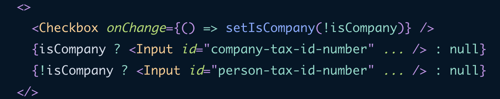
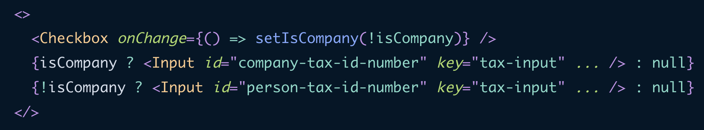
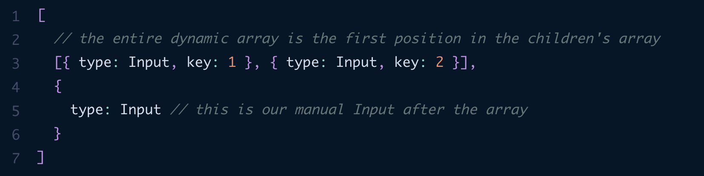

## Overview
All in all React is open-source library(or not ;) ) for building user interfaces with JS components

In it's core react "thinks" about UI in terms of *components*, aka modular functions, that take in *props* to configure and may have some changing *state* 

Terms:
- React - rendering library
- ReactDOM - package for DOM+Server rendering
- JSX - HTML in JS syntax extension for JS
	- compiles into valid JS(implementation is compiler specific tho)
- Redux - global state manager
- Hooks - functions that can manipulate and interact with components
- ReactNative - package for building cross platform with React
- Webpack + Create React App or Vite - bundle and build systems for JS
- Next.JS - meta-framework for easier work with React
- Component - main building block in React
	- there is no pages in React, only components with-in components
	- component should be a reusable peace
	- we can do components with **functions** and classes
	- components have props, that are just some values that passed in HTML-like manner from top
		- prop acts as blueprint
		- prop can't be changed from inside
	- component have state, that can be changed, thus making component re-render(change it's visual, corresponding to it's state)

To think in react way is to break large parts into small single-responsibility components, that are hold together by layout components

Basic patterns:
- compound - created set of related components that work with each other share state etc
	- examples: select, button group etc
	- recommendations:
		- use `Context` to share state
			- alternative approach is to do children mapping+cloning, so we can aggregate inner state props into our children component
				- cloning is done via `React.cloneElement`, that shallow merges passed props into component
				- be careful with children mapping, because we no longer would have and option to nest children
		- define one main component and export it + make other components accessible as properties of main component
			- establishes relationship between this components
		- use Components over configurations
			- Component is first-citizen in React
	- pros: all state is encapsulated, no need to import each child separately
- hoc - create component, that will add some existing(auth, styling, access control, state injection etc) functionality to passed in component
	- we can do hoc in different ways:
		- `const Comp = ...; export const hocedComp = hoc(Comp)` 
			- good for pre-creating set of components
		- `export const HocComp = ...; ...return <HocComp><Comp /></HocComp />` 
			- good for composing components on-fly
	- generally HOCs are great for composing components, but it is more common practice to use hooks for most cases
		- basically with HOC we keep logic in one place and with hooks we inject logic into component
			- HOC use-cases: component can work with/without HOC, nesting logic is required
			- hooks use-cases: behavior need to be altered by each component, behavior is not spread throughout the app
		- note, to manipulate component as an element, we can use ref
			- for example add some event listeners
		- be careful with HOCs in general:
			- they can lead to code that hard to maintain/understand
			- props naming collision

Why hooks:
- easier to inject functionality
	- no wrapper hell
- no need to refactor from function to class + deal with classes details like `bind`, `this`, `construct` 
- less spaghetti code in lifecycle methods
- easier to share logic
- code is easier to test

## React functional components (FC)
It is good approach to look at FC as pure function that takes in some args and return picture(landing)

## React hooks
React Hooks - functions that interact with react under the hood(manage state, call rerender etc)

They collected and processed in scope of component, so can't be called inside func or conditionaly(if/else)

Custom hooks:
- functions that starts with "use"
- can interact with react hooks
- should be treated as react hooks(non conditional call etc)

#### useEffect vs useLayoutEffect
Basically useEffect works before render and useLayoutEffect works after layout is rendered, so we can use it when working with useRef

#### Hooks
- use(*canary*)
	- used to read async value: `use(resource: Promise<value> | context) => value` 
	- can be called conditionally, in loops, BUT not in try/catch
	- use === useContext, if called with context
	- when called activates Suspense(waiting state) mode, if resolves correctly -> re-renders component with value, else fallbacks to nearest error boundarie
		- can be wrapper with `<Suspense>` to show some placeholder while fetching
- CONTEXT
	- createContext
		- used to create context: `createContext(defaultValue: any) => Context` 
		- can be combined with state to updates + useMemo/useCallback for memoization
	- useContext
		- used to read value from context: `useContext(Context) => value` 
		- subscribes component to context and it's updates
		- context can be used as global store OR in situations where you need to create components, that can be put in different context and behave differently
		- DON'T OVERUSE: try to parse props first, or extract components to top(by wrapping them into other components)
			- use-cases: theming, current logged user, routing, global state
	- Context.Provider
		- used to provide value to context: `<Context.Provider value={value}>{children}</Context.Provider>` 
			- if there is no `value` prop, useContext will return `undefined`
		- if no provider is found, react will return a default value of Context
		- can't be inside the same component/bellow, ONLY ABOVE
- useDebugValue
	- used to add label to custom hooks(inside react dev tools): `useDebugValue(valueToDisplay: any, format?: (value) => formattedValue)`
	- don't add labels to any hook, better to do if it is a shared+complex hooks
	- **LITTERALLY USELESS, EVERYONE HAS CONSOLE.LOG :)** 
- useDeferValue
	- used to defer updating a part of UI: `useDeferValue(value: primitive/ouside objects) => deferredValue` 
	- first renders with initial value, other re-renders goes like this: try to re-render with old value, re-render with new value in background
	- integrated with Suspense, so async data will render old value, until new appears
	- can be used with lazy, Suspense, use
	- MAIN REASON TO USE: to delay slow updates(make them lag behind)
	- ARTICLE
		- similar to useTransition, but for cases, where you re-renders happens from props/other, but not controllable state
- useId
	- used to generate uniq IDs, to use in accessibility attributes: `useId() => string` 
		- generated IDs will be associated with particular call + component
		- NO USSAGE IN KEYS
	- client and server must have same trees, otherwise IDs won't match
- useImperativeHandle
	- used to customize handle, exposed as a ref: `useImperativeHandle(ref, createHandle: () => ref, [dep1, dep2]?)` 
		- exposed refs are created with forwardRef((props, ref) => JSX) and allows to pass ref from parent into some element inside component
	- USAGE
		- not to expose full ref, but some values/custom methods that use values from it
		- to write laconic interfaces to interact with refs
	- good to imperative usages like scrollTo, zoomIn(online maps)
- useInsertionEffect
	- used to insert elements into DOM(mainly for CSS-in-JS): `useInsertionEffect(() => cleanUp()?, [dep1, dep2]?)` 
	- cleanUp will be fired with old values, before next re-render
	- can't update state + can't work with refs
	- fires before useLayoutEffect(fires before each repaint), which is fires before useEffect(fires after render finishes)
- useOptimistic(*canary*)
	- used to optimistically update UI: `useOptimistic(state, (currentState, optimisticValue) => {}) => [optimisticState, addOptimistic]` 
		- optimisticState is equal to state normally OR result of function while pending
		- addOptimistic is used to path inside optimisticValue
- useReducer
	- used to add reducer to component: `useReducer(reducer: (state: any, action: string) => {}, initialValue: any, init?: (initialValue: any) => initedValue: any) => [state, dispatch]` 
		- init - can transform initialValue before setting it
		- dispatch - that can take any action, but by convention it takes object with `type: string` properti
			- update value on next re-render
		- reducer
			- by convention handled with `switch` statement
	- can be used to move handlers into separate files/functions
	- can be used to group several state changes into one action
- useSyncExternalStorage
	- used to subscribe to external storage(some data that stored outside react, browser APIs): `useSyncExternalStore(subscribe, getSnapshot, getServerSnapshot?) => snapshot` 
		- subscribe - subscribe to store + return unsubscribe function
			- calls on every store change
		- getSnapshot - function that reads a snapshot
			- if returned value is different - component will re-render
		- getServerSnapshot - return initial snapshot data and used for SSR
	- only for sync storages
	- to make any class work with this, your class should have .clone() method, so it won't mutate, but change
- useTransition
	- used to update state without UI re-render: `useTransition() => [isPending: boolean, startStranstion: () => {... setState()}]` 
		- isPending tells if there any pending transition
		- startTransition marks a state update as transition
	- if re-render is in process, transitioned state change will happen before it
	- can make some slow calculations and only then render them
	- transition is interruptible, so good to use while building a router
	- can be wrapped in ErrorBoundarie(*canary*)
	- ARTICLE
		- state updates are sync and can bock UI interactions, so we have Concurrent Rendering to calculate changes in background
			- means react can pause/stop calculations if main changes are happening
			- JS is still single-threaded, so react will simply check if there is some actions in main queue from time to time
		- this calculations is happening in two steps
			- critical re-reder with old state + isPending -> true
			- background re-render
			- PROBLEM: now we have two re-renders, so we potentially doing heavy re-renders
			- SOLUTIONS
				- memoization + not passing isPending
				- using only when transitioning from lightComponent to heavyComponent OR make conditional rendering inside heavy components to make them light
		- won't work as debounce, because react is too fast

## Components
- Suspence
	- used to display fallback, until it's children are fully loaded: `<Suspense fallback={<Loading />}>...</Suspence>` 
		- if fallback suspends, it will be replaced with nearest Suspence fallback
	- suspence state is activated by
		- Suspence-enabled frameworks(Next.js)
			- it is possible to interact via JS, but it is not documented/recommended
		- lazy loading
		- use hook
	- not activated by useEffect
	- you can nest suspences and partially show content with different fallbacks
- Portal
	- used to render children into different part of DOM: `createPortal(children, domNore, key?) => JSX` 
	- key moment is: portal changes only position inside DOM, other things like scope, context etc is same as children will be placed inside parent element
		- events are propagating according to ReactTree
	- you can render react inside non-react parts of DOM
	- use-cases: dropdown, modal

## Reconciliation(согласування)
Algorithm of how react mounts and unmounts components(algorithm behind VirtualDOM)

reconciliation is separate from rendering itself

interesting thing: if we have conditional rendering of input and some text component, on condition change components will be unmounted/mounted and loose inner state, BUT if we have conditional rendering of two inputs this won't happen and one input will just re-render data inside itself(placeholders etc)

react stores everything in VirtualDOM because it is faster/cheaper to calculate changes in big object and that change real DOM
- in Virtual DOM react represents nodes as objects with some properties
- for first render react renders elements like this:
	- if it is native HTML element, then it will be just rendered to DOM
	- if it is function(other component), react will firstly call it and render all it's output
- other re-renders will be triggered by state change and will be depend on reconciliation(on every update react goes through components and checks if type/props changed)
	- if we change component's type it will be fully mounted/unmounted, otherwise only update is needed
		- to hack this behavior we can change conditional render, so it will be like this
			- 
			- now we have null <-> Input compare and components are fully mounted/unmounted
		- better way to fix this situation is to use key(react will compare elements not only by type, but also by key). More over it will not mount/unmount, but just swap order of elements
			- there is interesting behavior with keys, where you can save state between different elements like this
				- 
			- keys are often needed for arrays only because react assumes that arrays will be dynamic, but if we have just two inputs in a row it is often not dynamic and no need to care about keys
	- to fix problem where all elements after dynamic array are re-rendered if array itself is changed, react groups dynamic array elements into in-memory array like this
		- 
	- declaring component inside a component is anti-pattern, because react will always re-mount inner component, instead of re-render, because it will compare two different functions
- ALGORITHM
	- build tree that represents Current state of an App
	- send tree to renderer
	- onChange build work-in-progress tree
	- diff trees
		- using Heuristic method, that is O(n), but not precise
		- new Type, change of order -> unmount
		- key(1 depth) -> re-render
	- send diffs to renderer
	- NOTE: react breaks diff to small changes and prioritize them before sending to render
		- it is Fiber stuff

## Scheduling
one render tick for react
- go through tree recursively
- call update for all tree

react is using "pull" approach, where it can delay computation
	other libs can use "push" - computation done on new data arrival
this approach is taken, because react is UI renderer, so:
- we can hold some changes
- different changes have different priorities
- framework can some decide when to update

react is based on scheduling, but for now not uses it(fibers wants to change it)

## Fiber
reimplementation of core rendering react algorithm, that takes advantagies of scheduling

key features
- incremental rendering(ability to split rendering work into chunks and spread it out over multiple frames)
- ability to pause, abort, reuse work
- prioritize updates

react treats UI components as a functions => work of that functions are based on Stack tech, but it prevents flexible features above, so we can re-implement stack :)
	basically fiber is a unit of work(Virtual Stack Frame)

#### Implementation
fiber is an object, that contains data(input, output etc) about component(it corresponds to stack frame AND component)

fields
- type - function, class, string(for browser elements) + key // same usage as in reconciliation
- child - value, returned by component
- sibling(new) - other values, that are stored, when component returns multiple children
- return - return address of previous frame
- pendingProps + memoizedProps - props on start of execution and 
	- if both sets are same => we can re-use output
- pendingWorkPriority - sets priority of fiber(0 == no work, higher number == less priority)
- output - value that returned to render function

## State Management
#### React Context
- create context
- wrap app with context provider
- get value with use context

to mimic Redux can be combined with useReducer

#### React-Query
server-client state management, that hides store and it's modification as implementation detail

operation with data:
- get data - useQuery
- modify data - useMutate

#### Redux
- create global store, that handles all state
	- read-only, single source of truth
- specify reducer - function that take current state, action(type + other parameters) and return modified state, that replaces current state in store
	- after replace, redux notifies subscribed listeners that data has changed
	- history change can other CoL stuff are added on top
- actions are dispatched to store

#### MobX
uses class approach:
- store - class, where (methods - actions, fields - observable state OR computed state)
	- to convert class to store, in constructor add makeObservable + specify type of fields(action, observable, computed)

#### Effector
- event - message that smth changed
- store - object that handles data
- effect - async effects, localStorage
- connects entities as graphs

base idea that we subscribe to some changes and handle them

## Rendering patterns
#### Client Side Rendering (CSR)
Send bare-bones HTML container with large JS, that will render-out needed HTML, that depends on fetched data

Good for building single page apps(SPAs), that creates similar experience to native apps, while keeping everything in web
- still, can be a pain in the ass, while doing some basic web things(routing, page titles, SEO etc)
	- but if you conquer all of that, it will be great responsive UX(and DX too, for example client-server separation)
		- BUT, duplication and lots of mapping may arrive, so consider adding BFF layer
- very slow when talking about initial load, but fast for in-between loads
	- strive for less then 200kb initial JS
		- but to be real, be ready for ~2 seconds of initial load
	- note that it also slower in fetching data, because of longer trips to server
	- also can be slow on low-end devices

#### Selective Hydration
Something like island hydration in React world
In its core done by streaming HTML to frontend and partially hydrating it, while keeping slow components in suspension state and sending them later
- this way we don't need to wait for full render of a tree

#### Server Components
Experimental react feature, that lowers JS bundle size and reduces hydration time, with additional optimization to user
- also can reduce network times for data fetching

Done by building component into some intermediate state(on build or on fetch) and serving this intermediate components to client, where they can be converted to DOM
- it is possible to preserve state between refetches of components
- it might be possible to auto chunk main bundle on pre import basis

## Established UI patterns with React
It is important to layer and modularize complex apps, to keep them readable and easy to change
Most of patterns are framework agnostic, so modifications may be needed(or already done)
In it's core it is important to separate code by it's role(view <-> no-view)(one no-view <-> no-view)
- by so we can easily change domain logic, by not touching view logic

React is UI library(for the most part :) ), so it is awful practice to mix data consuming(rendering it) and logical manipulations with it: fetching, mapping etc
- so, Separation of Concerns is your friend
- basically react creates a way to manipulate DOM via rendering functions(components), but compressing all logic into components/hooks is bad practice
	- it is better to hook app logic into react with hooks

Main way to conquer large apps is via classical Model-View-Controller, which is an established practice to think about and structure your program(if it is large then 1 component)
- *I mean, you can write all app in ONE component, but please don't(in general)* 

#### Evolution of an app
- one component
	- state management, rendering, logic etc
- multiple components
	- container component: state management, logic, network logic etc
	- child component: pure-ish function to render UI
		- making component like so increases re-usability and testability
- state via hooks
	- hook: global state, logic, network logic, calculations, mapping etc
		- first use-case of hooks is to re-use logic between components, but they can be also beneficial as logic(state management, etc) encapsulator
	- container component: state management, render logic
	- child component: pure-ish function to render UI
- business model
	- fetcher: network logic
	- domain handlers: domain logic(mapping, calculations etc)
	- hooks: global state
	- container component: state management, render logic
	- child component: pure-ish function to render UI
- layering model
	- basically similar to business model, but we breaking app into layers like: infrastructure, domain, presentation; that hooked together

it is important to keep an eye on data leakage, because it makes even pure components harder to work with
- variations of leakages:
	- in-place mapping
	- conditional flows
- main way of conquering this problem is using classes, that encapsulate logic and data
	- or by using plain object(that implement interface) with combination of helper functions

NOTE: all of this is not about: "clean code: 1 file 5 lines", it is still important to keep some things together to avoid context switching
- good way of thinking about it, is how hard it would be to migrate to different render library, meaning how much logic you will rewrite

it is important to keep an eye on the **"shotgun surgery"** problem, which happens, when one change requires too many modification through codebase
- to solve this we can use polymorphism, helpers or similar logic
	- for example, when adding new currency to the system we no longer need to manually fix all switch cases, that operate with currencies, it is enough to update centralized one
	- what is cool about such handling is that we possibly can later move such logic to BFF, if it is using node
- similar problems can arrive, when working with data fetching, so it is good to break it into some steps: fetching, mapping, hooking into react

all in all we are getting:
- enhanced maintainability and readability
- increased modularity and composability
- improved scalability and migratibility
	- *just don't treat React as JS and you should be fine :)* 

## Other
React(and other frameworks) give possibility to work with minimum amount of state(network, API, user input, browser) and generate interface from it, so it is important to minimize state and do not create duplicate states(that will depend on each other)
- reduces complexity
- ups maintainability