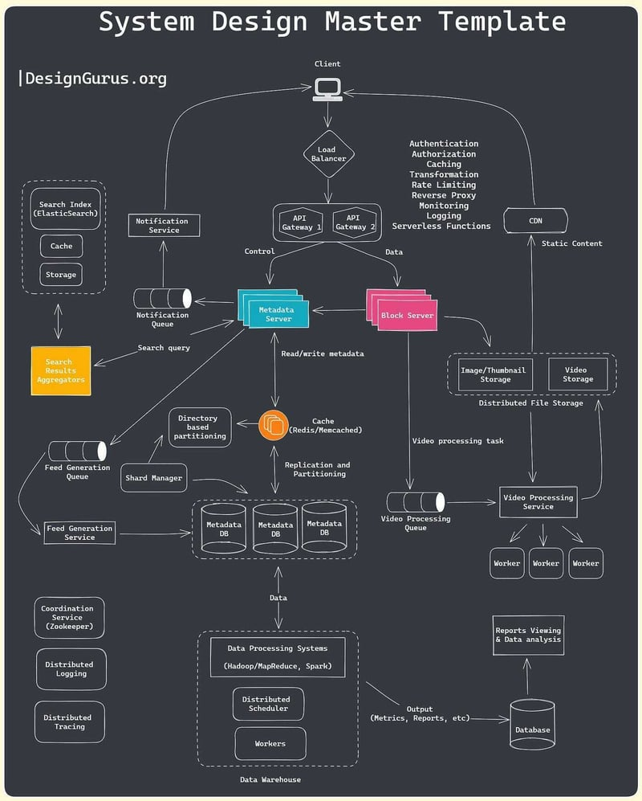
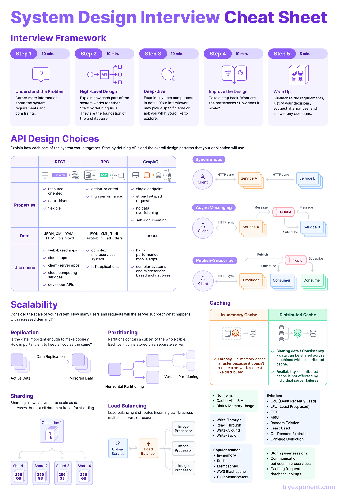

> Scale when needed, not because you can or it is popular
> *this applies using vertical scaling first, until it is too expensive OR impossible(bandwidth)* 

 

 

## Interview
- always start with understanding problem and gathering relevant details
	- relevant details: why we need this system, what functional will be included into system, requirements(functional and non-functional)
		- functional requirements - describe what tasks system must perform
		- non-functional requirements - describe how and on what constrains system must perform
	- when stating some requirement, explain why it is relevant
- define system constrains and estimates:
	- estimate priority (reads OR writes)
	- estimate number of: request per second, needed storage, bandwidth used
- define large parts of system and broadly APIs, define each part of a system in details, refine and repeat, memory(for caching purposes)
- summarize the decisions with possible alternatives

- when considering if improvements to system are needed remember about:
	- any change need to be justified by statistics
	- how much money will be spent AND earned after improvement

all systems have several attributes, attached to them
- prioritizing one attribute might negatively impact other
	- ex: more security == less UX

#### How to design
###### URL Shortener
- why we need it
	- optimize link size
	- hide original URLs (ex: affiliated links)
	- track link performance
- functional requirements
	- given URL service must return short/custom alias for it
	- when alias is accessed, user is redirected to original URL
	- each alias must have expiration time, with possibility to override it
- non-functional requirements
	- high availability
	- redirects must happen with minimal latency
	- short links can't be predicted
- extended requirements:
	- performance tracking
	- public REST API
- assumptions and constraints
	- New URLs - 200/s || URL redirections - 20K/s || Incoming data - 100KB/s || Outgoing data - 10MB/s || Storage for 5 years - 15TB || Memory for cache - 170GB
- API
	- Public API can be based on REST
		- example of endpoint: alias, that will expose CREATE, PUT, DELETE, GET
	- RateLimiting
		- can be done per-customer, by API_DEV_KEY
		- can be done per-api to prevent DDOS
- DB Design
	- notes:
		- service is read heavy
		- billion of records will be stored
		- each record is small
	- schema:
		- user <- alias
	- technologie: NoSQL
		- reasons: low number of relationships, billion of records, easy to scale
- Main algorithm variants:
	- encode actual URL into SHA256(or similar) hash format + transform it to readable, fixed size string via Base64 + crop part of it
		- 6 chars length is sufficient enough and will produce 64^6 variations
		- problems:
			- by slicing part of string repetition may occur - add shuffling to mitigate it
			- same URLs will produce same aliases - add salting OR user metadata(performance impact)
		- to mitigate uniqueness problem we need to add retries
	- generate keys before-hand and store in DB, serve keys on demand
		- benefits:
			- easy, cheap and fast solutions, with no collision problems
		- problems:
			- concurrency
				- move part of keys into memory and serve directly from there to avoid concurrency in-between slow calls to DB
				- mutex OR synchronization is required
			- single point of failure
				- introduce replica
- Additions:
	- redirect is done via 302 (Redirect) response
		- failing look-up should resolve into 404 OR redirect to default page
	- we should allow custom aliases with more then 6 chars, BUT prevent too large strings
- Partitioning - to allow storing billions of URLs we should partition data, some variations can be:
	- alphabetic range base - can lead to unbalanced partitioning
	- hashing - with consistent hashing algorithm, to make partitioning balanced
- Cache
	- tech: memcached OR redis
	- how much: based on predictions it is enough to have one large machine, that will cache ~20% of URLs(hot URLs)
		- but it is totally possible to have clusters of several machines
	- LRU is great technique for high reads and storing only hot URLs
	- if needed we can replicate our clusters
		- each replica can populate itself independently via read-through approach
- Load Balancing
	- it needs to be placed between: Client-Server, Server-DB, Server-Cache
- DB clean-up
	- don't serve expired links to users
	- freed key can be restored keyDB
	- cleaning strategies:
		- separate light-weight service, that runs in periods of low load and clean expired data in batches
		- remove on read request
- telemetry - can be implemented as separate service, with separate DB(for country, number of visits, user info, source of URL etc per-url) and be write focused(write-back technique)
	- don't forget to clear telemetry after some period of URL expiration
- it is possible to introduce user permissions per each URL

###### CDN
 - what is it - geographically distributed network of data-servers, that has main goal to deliver data fast and reliable
	 - it caches content on edge servers(small server, that located as close as possible to client)
- why we need it
	- reduce network latency
	- load balancing
	- remove single point of failure
- main components:
	- client
	- routing - distributes load, removes inactive sources from rotation, finds shortest route to the data
	- API Gateway - rate limiting, DDOS protection etc
	- proxy/edge services - serve content as close as possible to client
		- here content is cached, to reduce number of requests to origin
	- distribution system - sync content from main cluster with edge servers
	- content optimization service - reduce size of data
	- origin server - stores original content
	- logging & monitoring
	- management system - exposed part for user in form of public API (or web-app), that used for configuration, data management etc
	- load balancing is placed between major nodes
- caching
	- push - when new content appears, it is pushed from origin to edge
	- pull - cache is updated on demand
- routing:
	- how to find nearest proxy:
		- network distance - shorter path + higher bandwidth == preferable proxy
		- load - if edge is overloaded, request won't be routed here
	- ways to implement:
		- DNS redirect
		- anycast - all proxies will have same IP, while Anycast system will choose the most preferable one
		- client multiplexing - establish multiple connections and serve content from fastest
		- HTTP redirects
	- to achieve higher speeds and scalability, routing can be done in tree like shape, with more efficient nodes(one or several of them) placed in the middle between origin and edge
- fault tolerance:
	- if child fails - redirect client to other child
	- if middle-man fails - redirect child to other middle man
	- if origin fails - use replica OR, as last resort, serve content from middle-mans' caches
- examples: Cloudflare, Cloudfront etc

###### Whatsapp (chat app)
- requirements
	- functional
		- conversations - one to one, group
		- acknowledgment - track message status
		- sharing - sending files(images, videos, audios)
		- chat storage - messages should be persistently stored, even if user is sent them, been offline
		- notifications - new messages should result in notifications
	- non-functional
		- low latency
		- messages order consistency
		- availability (can be compromised, if it will increase consistency)
		- security - done via e2e encryption, where only people, that chatting, can see the contents of messages
		- scalability
- high-level design
	- userA establishes websocket connection with server, sends encrypted message to server, server acknowledges, server holds message until userB is online, server sends message to userB, userB acknowledges, server notifies userA that message is sent, userB reads, userB notifies server that message was read, server notifies userA that message was read
	- data model design:
		- users
		- user_groups
		- user_chats
		- groups
		- chats
		- messages
	- API:
		- can be done via REST for broad support
		- file upload can be done as two step process:
			- upload file, receive URL
			- share URL via message in specific format
	- architecture: micro-services, because it is easy to scale and decouple
- low-level design
	- users connect to WebsocketService, through load-balancer
		- mapping and management is done via WebsocketManagerService
		- WebsocketManager is connected to Redis cluster to store any needed data
	- all messages can be retrieved from MessageService, that is connected to some persistence-first DB, like Mnesia
		- it exposes APIs to manipulate messages
		- it has auto-purging of historical data
		- messages will be retrieved and stored in encrypted format
	- all file operations are done via FileService
		- compression and encryption is done on device
		- blob storage is used to store files
		- each file is tracked via public id(for sharing) AND via private hash(to avoid duplicated data)
		- frequently used files can be pushed to CDN
	- group messages can be routed to specific GroupMessageService, that will route it to Kafka. GroupMessageService communicates with GroupService to retrieve info about each group participant and sends messages to each user
		- GroupService will have SQL-based DB, for ease of working with relational data
			- this DB can be replicated geographically
			- Redis is needed as cache here
- non-functional requirements achievement
	- low latency
		- CDN, geographical replication, caching
	- messages order consistency
		- FIFO queueing, acknowledgment mechanisms, persistence DB
	- availability
		- data replication, multiple load-balanced servers
	- security
		- e2e encryption
	- scalability
		- horizontal via micro-services

## API Design
Describe how each part of the system works and why

#### Main Types
- REST
	- flexible, data-oriented, has mass adoption
	- JSON and text based protocols
	- used for Web products, public/internal APIs, cloud apps
- RPC
	- high performant
	- JSON, protobuf(have lover support, because uses bites to communicate)
	- used for IoT, microservice architecture
- GraphQL
	- single endpoint, strongly typed and self documented
	- poor performance, has security risks
	- used for complex APIs

#### Communication Strategy
- sync - all requests done in sync, via HTTP
- async messaging - service post messages into queue and subscribe to it, to receive any response messages
	- usually done in 1 to 1 manner
- publish-subscribe - service producer publishes messages into shared topic, services consumers can subscribe and receive any messages from this topic
	- done in 1 to many manner

## Scalability
Thing about how many users and requests system needs to handle. What types of this requests(reads or writes)

types:
- vertical - add more machine power for single machine
- horizontal - add more machines and distribute load

#### Replication
Process of copying data, that has several purposes:
- creating back-ups
- hosting data near locations of usage(US region, EU region etc)

Depending on purpose you need to consider several questions:
- is data need to be replicated?
- how often replications will happen?
- how accurate duplications need to be?

#### Partitioning
Process of breaking large DB into some logical parts, that will be stored on the same/external server, in order to make DBs more manageable, faster and more available
- the general focus of partitioning is to reduce cost of queering large data sets

examples
- introduce numeric ID per data-entry and partition by ranges
- partition by date ranges
	- great for migrations, because you can migrate only relevant data and keep historical partially empty

types
- vertical - each partition will have subset of columns + some key to connect them
	- great for splitting many columns and queering commonly used separately from less ussed
- horizontal - all columns stays the same, only rows are partitioned
	- optionally, data is distributed across several independent servers

benefits:
- higher response times, faster reads-writes, higher availability
- faster maintenance(back-ups, migrations etc)
- more storage per partition
	- several servers only
- outages are isolated
	- several servers only
- access control per partition
problems:
- introduces complexity
- higher possibility of errors
- poor and unbalanced partitioning will slow down system
- takes more space

###### Sharding
Type of horizontal partitioning, where we break large data into small chunks(shards) and store each shard/collection of shards in separate machines

To query data you generate and assign shard-keys per shard
- example: store users in shards, depending on their region, so all US users will be in US shard and all EU users in EU shard, thus making most of calls from each regions more optimized(request takes less time to travel), without overhead of full doing DB replication
	- note: we aren't accounting for number of users per region, thus US shard can be much larger and require separate sharding step, in comparison to Australia

great for dealing with traffic and data amount grows

#### Load Balancing
Technique to evenly distribute traffic amount several machines

use-cases:
- traffic distribution
- ensuring high availability by avoiding routing to inactive machines
- session maintenance
- SSL/encryption related operations

#### API Gateway
Technique to create single entry point to system, that can handle several functions:
- authN + authR
- caching
- request transformation + protocol transformation
- rate limiting - limit number of requests per some amount of time
	- usually done by tracking how much time elapsed from previous requests from same IP(or by signing each request with some other metadata)
	- response from rate limiter can be either 429(too many request) OR requests can be held in some queue
- routing, versioning etc AKA reverse proxy
- monitoring + logging
- serverless functions

problems to address:
- single point of failure
	- as any single entry point to the system
	- to address: replicate and load balance
- additional network overhead(risk of failing requests, requests take longer)
- raise of system complexity and additional maintenance
- security miss-configurations

#### Caching
###### Types
in-memory - data stored in RAM, so there is no need to add network overhead, BUT this way cache can be only local

shared - cache stored on separate machine, so it is accessible to all services
- cache is available, even if some service failed
- cache is consistent for each machine, so no need to create local caches
- problems:
	- network overhead is present

###### Main terms
- number of items cached
- how much RAM or Disk Space is consumed by cache
- cache miss & hit - on way to measure cache effectiveness is to look how often we hit it, instead of going to DB or doing requests etc

###### Strategies
- write-through - data is saved into main storage + cache at the same time
	- all writes are slower
- read-through - when request misses cache, cache holds request, auto-populates itself from DB and returns response
	- non-cached reads are slower
- cache-aside - when request misses cache, system goes into DB instead, populates cache and returns response
	- non-cached reads are a bit slower
- write-around - write requests are pushed into DB, data cached only after a number of read requests
	- frequently accessed data is prioritized
- write-back - write requests are stored inside cache and unloaded into DB once per some amount OR time period
	- writes optimized

###### Implementations
- in-memory - often via some libs or structures, like `Map` 
- redis - robust, stand alone, in-memory cache
- memcached
- AWS Elasticache
- GCP Memorystore

###### Use-Cases
- storing user sessions
- reduce overhead of microservice communication
- caching frequent DB operations (reads OR writes)

###### Invalidation strategies
- time based - invalidate after some time
	- types:
		- time to live (TTL) - each data has some time, that it can live, after been cached, after which it will be refetched, if accessed again
	- great for tokens
- event based - invalidate after some event occurs
	- types:
		- purge - remove cache
		- refresh - invalidate cache and request new one
		- ban - remove cache and stop caching
		- stale-while-revalidate - serve cached versions, then update
			- often used in CDNs

###### Cache eviction
Cache size is limited, so we need some method to make a room for new one, by efficiently removing other

- Least Recently Used (LRU) - remove last used data
	- web pages in browser
- Least Frequently User (LFU) - sort data by frequency and remove one at the bottom
	- search engine queries
- First in First out (FIFO) - remove data in order it was cached, similar to Queue
	- messages in messaging app
- Most Recently Used (MRU) - remove first used data
- Random Replacement (RR) - remove random data
	- data set with no priority between items, like assets in game
- Least Used - globally sort data by frequency and remove OR avoid caching ones at the bottom
- On-Demand Expiration - cache can be freed only manually
	- the case, when managing in-memory cache in languages like C++
- Garbage Collection - cache freed automatically
	- the case, when managing in-memory cache in languages like C++

###### Common problems
thundering herd problem - multiple cached items expired, thus all requests will miss and overload the system
- solution: warm cache in periods of in-activity

 cache penetration - user DDOS service with non-existent data, thus preventing any cache hits and overloading the system
 - solution: input validation, rate limiting of request

cache breakdown - cache breaks, thus all requests will miss and overload the system
- solution: implement failover and auto-recovery mechanisms, introduce health checks and system monitoring

stale cache - cache data is invalid, thus system operates on improper data
- solution: add logging to catch this issues, use stable technologies and patterns to avoid caching problems

## Other concepts
#### Single Sign-On (SSO)
Tech that allows for user to sign once and access all parts of the system after it
- as benefit for devs, removes need to create separate authN flows per each app

can be detected by redirect to separate login page

implementation strategies:
- sub-domain + cookies - straightforward way, done by hosting all apps under single domain, thus allowing all of them to share cookies
	- benefits: easy to implement
	- problems: limited by sub-domain, specific implementations will arrive on each consumer, depending on their technologies
- separate auth service - create service that will be a single source of authN&authR truth
	- implementation notes:
		- based on token model(access + refresh), where token can be in JWT or some other hash format
			- such token contains all info about user and can grant full or partial permission to system
			- JWT (JSON Web Token) - format of encoding JSON into Base64 to transfer through net
	- benefits: cross-platform, one service handles all user & auth management, broadly adopted standard, user permissions can be granted partially(it can also depend on application, you logged in)
	- problems: it is hard to recover lost token so additional safety measures need to be implemented

#### DB Design
###### SQL(relational DB) vs NoSQL(non relational DB)
Crucial point in DB design, is choosing what type of DB you need, based on your requirements and needs

SQL - focus on data with relations and column+row mental model
- have predefined schema
- can be scaled vertically and horizontally
- can be partitioned vertically and horizontally
- stores data in form of a table, with primary and foreign keys
- great for structured data, complex data, transactional data
- design is rigid, SO any change will require migration
- examples: PostgreSQL, MySQL

NoSQL - focus on flexible and dynamic data, with loose relations
- schema and types are dynamic
- can be scaled vertically and horizontally
- can be partitioned only horizontally
- stores data in format of a: document, key-val, graph; basically we can choose the most suitable format for data
- great for data like: documents, JSON
- can be easily scaled-up OR down
- data can't be accessed in complex manner AND data normalization may be needed
	- this leads to different syntax per DB
	- no need for complex migrations, structure can be changed with ease
- can be great starting point, where requirements are loose and you need to change fast
- examples: MongoDB, Casandra, Redis

###### DB indexing
In general, index is a way to point to some information
- DB index have similar function and enabled faster read queries, because engine don't need to scan full DB to find something, it can do scanning, based on indexes
	- it acts as sort of metadata

types:
- clustered index - acts as primary keys for indexing
	- changes order of data in DB
		- data will can be stored as Balanced Binary Tree, thus enabling direct Binary Search on data
	- can be only one per table
- non clustered index - acts as additional/secondary index
	- doesn't affect original data, BUT requires additional table to be stored, where it stores index + pointer to data location
		- additional table can be stored as Balanced Binary Tree, thus enabling Binary Search on this metadata to find reference/pointer to original data
	- can be several per table
	- it is recommended to add indexes for most commonly used columns, when:
		- filtering (`WHERE`)
		- sorting (`ORDER BY`)
		- grouping (`GROUP BY`)
		- joining (`JOIN`)

problems:
- data modification queries are slower, because index sync is required

alternatives to BBT:
- hash (don't requires balancing, but won't work for range quires)
- bitmap (great for read-heavy operations with small number of possible values)

sparse indexes - refer to partial data storage, meaning we index only some chunk of data

#### Proxy
###### Forward Proxy vs Reverse Proxy
Both proxies are important types and have distinct roles, main different comes from level of network operation

forward proxy - interface that client uses to interact with system
- use-cases: client anonymity(change client's IP to proxy's), caching, traffic control, logging, request/response transformation, authN&authR

reverse proxy - facade for single/multiple servers
- use-cases: server anonymity, caching, load balancing, DDOS protection, canary, request/response transformation, encryption/SSL management(offload servers)
- examples: Nginx

#### Serverless
Model of building backend, where all responsibility for managing server(env and machine) is offloaded to provider, so there is only need to write application code, that will execute logic and interact with simple APIs, from provider
- it is similar to Infra as a Service modal, BUT here you don't need to do any management of infra at all
	- also you pay per request AND NOT per machine

types:
- function as service - execute specific function in isolation
- backed as service - execute entire application

use-cases(often short lived tasks):
- API integrations
- trigger based actions
	- schedulers
	- notification sender
	- webhooks
- automations
- data-processing
- backends (with low load on it)

benefits:
- auto-scaling, load balancing and other benefits are already done
	- no need to manage any server infra, thus faster dev time
- pay per request
- language agnostic

disadvantages:
- you will go broke as your traffic grows ;)
- can't execute for too long
- additional delay to spin-up
- vendor-lock

#### Authentication
Authentication can be done in different ways, where each way have some use-case, specific benefits and constraints

###### JWT (JSON Web Token)
JWT is way to encode JSON into binary format, so it can be easily transported
- it is not authentication technique by itself, BUT can be used to identify users in authN flow
- additional public/private encryption and/or hashing can be added for safety
- includes: expiration data, user info, issuer and additional metadata
- flow:
	- client provides credentials
	- server creates JWT, stores and return it to client
	- client saves it somewhere(commonly in cookie OR in-memory)
	- client adds token as part of request(usually as some dedicated header), so server can receive+verify token and proceed with request
- additionally:
	- it is possible to have several tokens, for better UX
		- session token - works as described above
		- refresh token - used to generate new session token, without need to provide credentials
- note: authR is managed separately and not a part of JWT

###### OAuth
It is a protocol, that enables authN & authR via/with third-party service(identity-provider)
- use-cases:
	- give granular access for third-party to your service
		- ex: allow service to edit user's GoogleCalendar
	- authenticate user into your service, based on data from identity-provider
		- ex: Sign-in with Google
		- this requires usage of OpenID Connect protocol
		- for successful login identity-provider returns token, that can identify user in service
- alternative: Federated Credential Management(FedCM) browser API

###### SAML (Security Assertion Markup Language)
XML-based standard of exchanging authN & authR data between parties
- flow:
	- client provides credentials
	- server creates SAML assertion in XML format
	- client can re-use this assertion to authorize requests from itself
- common use-case: SSO

#### Related Algorithms and Data Structures
Consistent hashing - algorithm to evenly distribute data between multiple nodes
- implementation: for each node assign range of hashes, hash each data and assign it to node that covers value in it's range
	- additionally, it is possible to assign data and ranges to virtual nodes AND assign several virtual node to physical one, thus making down/up-scaling and data transfer easier
- use-case: DB partitioning

MapReduce - algorithm for processing large data sets in parallel, thus making it faster and reliable
- implementation is broken into several steps:
	- break all data into smaller chunks
	- map each chunk in parallel (result is often some key-value pairs)
	- merge and sort all chunks together
	- reduce result, so all keys are merged into one and each value is included in final result (ex: each value is summed, multiplied etc)

Distributed hash tables (DHT) - way to store data in key-value manner, so each pear of network can hold only part of data, thus systems becomes faster, easier to scale and more resilient in self-organization manner
- allows to locate value by only querying small number of participant
	- enabled by proper distribution algorithm
- use-cases: p2p networks, CDN, distributed DB

Bloom filters - algorithm to efficiently detect if data is present in some set, by hashing and using bit map arrays
- can produce false-positive results, BUT with proper number of hashes and size of bit array, this rate is quite low, so can be tolerated, for large data-sets

Two-phase commit - algorithm to ensure consistent transactions in distributed systems
- flow:
	- coordinator asks all nodes if they can commit
		- if any answer is missing or "no", operation is aborted
		- if all answers are yes, operation proceeded
	- coordinator asks all nodes to commit
	- each node commits and sends status
		- if any answer is missing or "failure", coordinator asks all nodes to rollback
		- if all answers are "success", coordinator informs all nodes that operation is successful
- problems:
	- higher latency
	- single pointe of failure
	- dead-lock

Paxos - algorithm to ensure consistent values in distributed systems, with failure tolerance
- flow:
	- coordinator asks all nodes to remember some value
		- if majority answered - operation proceeded, else - aborted
	- coordinator asks all nodes to accept some value
		- if majority accepted - value accepted

Raft - algorithm to ensure consistent stream of values in distributed systems, with failure tolerance
- flow:
	- group of nodes elect the leader
	- leader accepts the data and passed it to all nodes
		- node can request data from leader too
	- if leader fails, re-election happens

Gossip - efficient algorithm to share data in p2p systems, with high failure tolerance
- all data is transferred from node to it's closest neighbours, thus populating network
	- it can be transferred on demand (pull) OR when new data arrives (push)

- CAP theorem - theorem, that states, that distributed system can't achieve all characteristics simultaneously
	- consistency - all nodes have same and up-to-date info
	- availability - system is always responds
	- tolerance - system is responds, even if part of it dies

#### Encryption
###### Symmetric Encryption
Method of using single key to encrypt/decrypt data
- this key can be viewed as a password, that need to be known by two sides beforehand AND can be shared at any point

###### Asymmetric Encryption
Method of using pair of keys to encrypt/decrypt data
- public key - used to encrypt data, can be shared
- private key - used to decrypt data, stays with party, that created pair

###### E2E Encryption
Method that encrypts data, to prevent any access to it, when it is transferred from one user to other
- it is encrypted on one side and can only be decrypted on other side

how it is done:
- based on asymmetric encryption
- uses insurance system, that prevents man in the middle problem
	- insurance is done via legitimate third-party authority, that embeds keys into certificates

###### Transit Encryption
Method that encrypts data, to prevent any access to it, when it is transferred, but overall systems includes middle man, that encrypt/decrypt data, before sending it to users

how it is done:
- based on asymmetric encryption
- uses insurance system, that prevents man in the middle problem
	- insurance is done via legitimate third-party authority, that embeds keys into certificates

#### Technologies
###### Redis
- it stores cache in-memory, BUT have option to dump data into disk

###### Kafka
Kafka is used for decoupling data source from target system by acting as intermediate layer, that stores and enables data consuming

problems it solves:
- unify data formats
- unify transfer protocols
- reduce complexity, make system more maintainable and resilient
- allows handling high number of connections

specs:
- open source
- used as framework for storing, reading and analyzing data streams
- build to be horizontally scalable

use-cases:
- messaging - activity tracking -- (working with streams)
- gather metrics, logs or any data from multiple sources
- stream operations
- big data

concepts:
- topic - temporal data storage
- partitions - each topic can be configured to be auto partitioned
- offset - ID, assigned per message, that relevant in scope of partition
	- each message can be found with `topic+partition+offset` 
- broker - separate servers, that store partitions
	- group of brokers == cluster
- replication - kafka can be configured to auto-replicate data to a given number of times
	- separate partitions are replicated
	- replicas will always be stored in other brokers
	- replication is done via leader system, basically kafka has one leader, that performs read+write operations AND followers, that sync themselves with leader AND can become leader if original leader is failed
- producer - kafka uses load-balancers, called producers, that perform writes to leader partition
	- all data is pushed to end of the topic
	- algorithm: locate all brokers with leader partitions, choose the least loaded one, append data
		- it is possible to provide key, that will be used to choose partition manually
			- note: same key will always result in same partition
	- data can be synced in this way(each has different risk of data loss):
		- no acknowledgment - producer pushes data without waiting for any response
		- 1-acknowledgment - producer pushes data with waiting for leader response
		- n-acknowledgment - producer pushes data with waiting for leader and n-1 replicas response
- consumer - kafka uses load-balanced consumers, that read data from leader partition
	- for better performance, consumers are packed in consumer groups, and read only portion of data from topic each(1 consumer per 1 partition)
	- kafka maintain consumer offset - int number that points to last read data, so consumer won't return duplicates
	- consuming stratagies:
		- at most once - message better be lost, than duplicated
			- offset is changed after message is received, rather then processed
		- at least once - message can't be lost, but can be duplicated
			- offset is changed after message is processed
			- application must be idempotent
		- exactly once - message can't be lost and can't be duplicated
			- achieved via kafka-2-kafka streaming
	- consumer connects to 1 broker first, receives info about cluster, connects to other brokers(if needed)
- zookeeper - core software, that used to manage distributed system under the hood of kafka

###### RabbitMQ
For more robust and efficient service-to-service communications we can use Message Based communication, where each service interacts through a MessageBroker mediator
- improves speed
- reduces coupling of services
- allows for load-balancing messages to consumers

RabbitMQ is open-source MessageBroker
- most popular way of using is with Advanced Message Queuing Protocol, that sends data in frames in custom binary format

Concepts:
- producer - writer to MessageBroker
- consumer - reader from MessageBroker
- queue - intermediate storage for messages
- connection - RabbitMQ allows for TCP connections to it
	- RabbitMQ establishes single connection, BUT it splits it into channels and uses them to send data
- exchange - receives messages from producer and pushes them to 0-n queues
	- exchange configured via rules, called bindings
	- exchange do routing based on binding AND received route-keys(addresses)
	- types:
		- direct - route to queue, by provided key
		- fanout - route to all queues, specified in binding
		- topic - do wildcard match between binding and key
		- header - route by data in message's header
- users - each instance of RabbitMQ includes authN and authR built-in
	- each instance can be broken into virtual once
- acknowledgements - rabbit allows for loss free transfer via acknowledgement system(from consumer OR from exchange)
	- acknowledgements can be batched
- prefetching - rabbit allows to set sliding window, of how many messages can be sent over one channel, before acknowledgement is received
	- too high will cause overflow, too low will slow down transfers

best practices:
- keep queue size limited
	- too large queue results in high RAM
	- RabbitMQ has preserving RAM mechanism of flushes to the disk, BUT it will degrade performance
	- how-to:
		- limit queue size OR add TTL
			- results in messages loss
		- make acknowledgements fast
			- they can be done in async manner, BUT it will result in messages loss
- multiplex TCP + limit TCP connections
- keep connections long lived
- if loss isn't and option, don't limit queue AND enforce acknowledgements
- isolate consumer and producer with different connections, if done in single app
